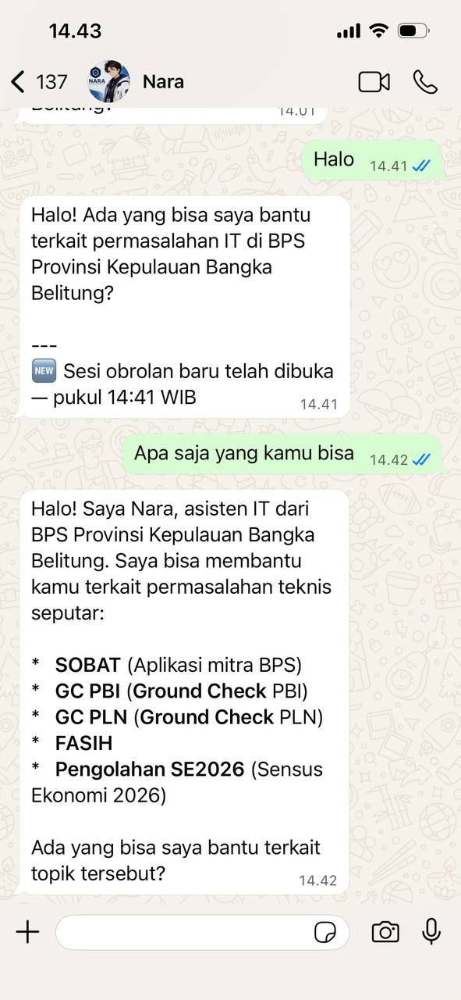
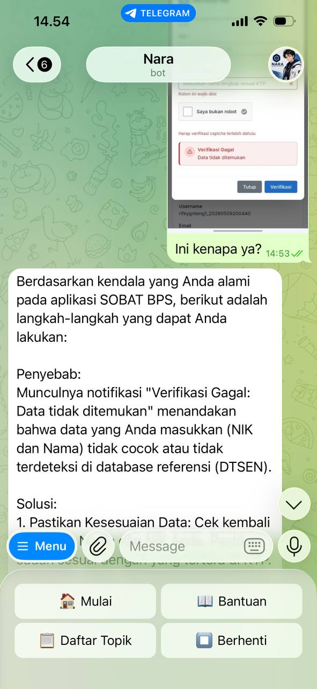

# NARA (NextGen AI Response Agent)

> **N**extGen — Teknologi modern dan inovatif
> **A**I — Kecerdasan buatan sebagai mesin utama
> **R**esponse — Fokus menjawab dan merespons kebutuhan pengguna
> **A**gent — Asisten digital yang bertindak atas nama layanan

[](https://python.org)
[](https://fastapi.tiangolo.com)
[](https://core.telegram.org/bots)
[](https://whatsapp.com)
[-purple)](https://huggingface.co/intfloat/multilingual-e5-base)
[](http://localhost:8001)
[]()

Asisten permasalahan IT dari **BPS Provinsi Kepulauan Bangka Belitung**. Siap membantu pertanyaan seputar aplikasi dan layanan internal BPS via Telegram & WhatsApp.

> **Stack:** FastAPI + Hybrid E5+BM25 (RRF fusion) + Multi-LLM failover + SQLite + EasyOCR + PlayStation Dashboard

---

## 📋 Daftar Isi

- [📸 Tangkapan Layar](#-tangkapan-layar)
- [🛠️ Tech Stack](#️-tech-stack)
- [✨ Fitur](#-fitur)
- [🧠 Arsitektur Modular](#-arsitektur-modular)
- [🧠 Detail Hybrid Search (E5 + BM25 via RRF)](#-detail-hybrid-search-e5--bm25-via-rrf)
- [🧠 Intent Classifier (CLF)](#-intent-classifier-clf)
- [🧠 Multi-Part Split (E5 Semantic Boundary)](#-multi-part-split-e5-semantic-boundary)
- [🧠 Cascade Fallback (BM25 + E5 Guard)](#-cascade-fallback-bm25--e5-guard)
- [🆚 Perbandingan & Arsitektur Pipeline](#-perbandingan--arsitektur-pipeline)
- [🔒 Security & Proteksi](#-security--proteksi)
- [📊 Logging & Evaluasi](#-logging--evaluasi)
- [🖥️ Dashboard](#️-dashboard)
- [⚡ Optimasi Performa](#-optimasi-performa)
- [🔗 API Endpoints](#-api-endpoints)
- [💻 Panduan Instalasi — Windows](#-panduan-instalasi--windows)
- [🐧 Panduan Instalasi — Linux](#-panduan-instalasi--linux)
- [✅ Verifikasi](#-verifikasi)
- [🔄 Replikasi / Custom Bot](#-replikasi--custom-bot)
- [❓ FAQ](#-faq)
- [📜 Riwayat Versi](#-riwayat-versi)
- [📞 Kontak & Dukungan](#-kontak--dukungan)
- [📄 Lisensi](#-lisensi)

---

## 📸 Tangkapan Layar
<table>
  <tr>
    <td></td>
    <td></td>
  </tr>
  <tr>
    <td align="center"><sub>WhatsApp</sub></td>
    <td align="center"><sub>Telegram</sub></td>
  </tr>
</table>

---

---

## 🛠️ Tech Stack
| Layer | Teknologi |
|-------|-----------|
| **API Server** | FastAPI (Python) |
| **Domain Gate** | BM25 3-tier — <3 tolak, 3-4.9 QNA link, ≥5 hybrid search. Cascade BM25 depth 3 untuk follow-up pendek |
| **Hybrid Retrieval** | E5+BM25 via RRF fusion (K=30) — E5 semantic + BM25 keyword + **category-aware BM25** (v2.8.0), top-5 FAQ |
| **Intent Classifier** | scikit-learn SGDClassifier + TF-IDF (pure Python, 185KB, 97.4% accuracy) — 5 kelas: greeting, capability, positive_feedback, negative_feedback, forward. Fallback keyword regex |
| **LLM Gateway** | Multi-provider: OpenCode → DeepSeek → Ollama lokal — auto failover chain |
| **Multi-Part Split** | E5 Semantic Boundary — heuristic split (konjungsi + delimiter) + E5 cosim merge (threshold 0.78) |
| **Database** | Google Sheets (FAQ live sync) + SQLite (chat history + daily limit) |
| **Telegram** | python-telegram-bot (Polling) |
| **WhatsApp** | whatsapp-web.js (Node.js bridge via Flask) |
| **OCR** | EasyOCR (Indonesia + Inggris, lazy load ~500MB) |
| **Dashboard** | FastAPI + vanilla HTML/CSS/JS (port 8001) — Live Terminal, RRF chart, Query Monitor |
| **Bahasa** | Python 3.11+ / Node.js v22 LTS

---

---

## ✨ Fitur
| Fitur | Detail |
|-------|--------|
| 🤖 **AI Answering** | Multi-LLM dengan failover chain. Coba provider 1 → error? auto lanjut provider 2 → dst. Cloud API (OpenAI-compatible) & Ollama lokal |
| 🧠 **Domain Gate (BM25 3-Tier)** | **3 tier**: BM25 < 3.0 → OOC (tolak), 3.0-4.9 → BM25_BORDERLINE (QNA link), ≥ 5.0 → lanjut hybrid search. Cascade BM25 depth 3 untuk follow-up pendek (best practice: NVIDIA 3-5 turns, Chatnexus sliding window 3). **Zero LLM cost untuk out-of-context & borderline.** |
| 🧠 **Hybrid Search (E5+BM25 via RRF)** | E5 semantic + BM25 keyword fusion via Reciprocal Rank Fusion (K=30). RRF **hanya untuk ranking** (bukan gate). Kategori sebagai metadata — dari v2.8.0 di-append ke BM25 doc text biar keyword kategori ngaruh ke ranking. top_k=5. Centroid di-log untuk analytics. |
| 🧩 **Multi-Part Split (E5 Semantic Boundary)** | 3-layer: Comparison Guard (regex perbandingan) → heuristic split (konjungsi + delimiter) → E5 cosim merge (threshold 0.78). Bagian di luar BPS di-skip. |
| 🏷️ **scikit-learn Intent Classifier** | SGDClassifier + TF-IDF — pure Python, zero C++ compiler. 5 kelas: greeting, capability, positive_feedback, negative_feedback, forward. 4 kelas respon langsung (template statis), skip retrieval & LLM. Keyword fallback safety net. |
| 📱 **WhatsApp Integration** | Bridge via `whatsapp-web.js`. QR scan, typing indicator, support gambar + OCR |
| ✈️ **Telegram Bot** | Reply keyboard, typing indicator, "⏳ Memproses gambar..." (auto-hapus setelah jawaban) |
| 🗣️ **OCR Gambar** | Screenshot error dibaca otomatis via EasyOCR. Support Indo + Inggris. **Bebas limit 500 karakter** (khusus OCR). |
| 🔄 **Auto-Reload FAQ** | Download ulang dari Google Sheets tiap 12 jam. Bisa reload manual via `/reload` atau tombol Reload FAQ di dashboard |
| 📜 **Chat History** | Semua percakapan tersimpan di SQLite — kolom chat_id, pertanyaan, jawaban, source (API/WA/Telegram), BM25, RRF, gate status |
| 📊 **Dashboard** | Monitoring real-time: Live Terminal, RRF chart, Queries/Hour, Top FAQ, LLM response time, Daily users. **Feedback stats cards** (✅/❌/⏺), **Feedback filter** di Query Log. Sidebar collapsible (desktop + mobile). |
| 🔄 **Cascade Fallback (E5 similarity + Short Follow-up)** | Jika BM25 < 5 + ada history → concat prev query depth 1-3. Query < 3 kata (**short follow-up**: `"tetep"`, `"gimana"`) **skip BM25 gate & E5 guard** — langsung cascade. Jika cascade BM25 ≥ 5 → hybrid search. Jika < 5 → borderline fallback (bukan OOC). Query ≥ 3 kata tetap pake E5 similarity guard (≥ 0.78). Cegah query non-BPS numpang keyword. |
| 🎯 **Tombol Feedback** | Setiap jawaban CLF forward diberi footer "💡 Apakah jawaban ini sudah membantu?". **Telegram**: inline keyboard [✅ Sudah] [❌ Belum] — tap langsung kirim, keyboard otomatis ilang. **WhatsApp**: native Poll ✅ Sudah / ❌ Belum — vote otomatis hapus (delete for everyone). **Fallback manual**: reply 👍/👎 atau balas "sudah"/"belum". **Context-aware**: positive_feedback + konteks → stop session; negative_feedback + konteks → minta detail app+error. **Tracking otomatis** — semua feedback (tombol & chat) tercatat di `feedback_status` query log |
| 🧹 **Input Sanitasi** | Karakter kontrol dibuang, emoji dibatasi maks 5, teks biasa maks 500 karakter (kecuali OCR). |
| 📝 **Markdown di Telegram** | Kirim **bold** dan *italic* via `ParseMode.MARKDOWN`. WhatsApp otomatis strip formatting. |
| 📊 **Query Logging** | Dual-log (JSONL + SQLite) — 25 kolom: pertanyaan asli user, CLF, RRF, E5 Top, BM25 Gate, BM25 Raw, gate status, LLM response, source tracking, **feedback_status**. `top5_faq` diberi label ranking (#1-#5) |

---

---

## 🧠 Arsitektur Modular
```
chatbot-qna/
│
├── server.py                 ← FastAPI router — inti logika chatbot
├── telegram_bot.py           ← Layer Telegram (OCR, sanitasi, kirim API)
├── wa_handler.py             ← Layer WhatsApp (Flask, terima dari bridge)
├── dashboard.py              ← Dashboard monitoring (port 8001)
├── start-all.bat             ← 1 klik buka 5 terminal + dashboard
│
├── core/                     ← 🔧 Mesin utama
│   ├── database.py           ←   SQLite: session chat history, daily limit
│   ├── embedder.py           ←   E5-base: load, encode, hybrid search (E5+BM25 RRF)
│   ├── bm25.py               ←   BM25: per-doc scoring untuk hybrid retrieval + domain gate
│   ├── intent_classifier.py  ←   scikit-learn SGDClassifier + TF-IDF intent classifier
│   ├── classifier_train.txt  ←   Training data (845 sampel, 5 kelas)
│   ├── intent_model.pkl      ←   Trained model (auto-generated, ~185KB)
│   ├── llm.py                ←   Multi-provider LLM, failover chain, build prompt
│   └── query_logger.py       ←   Query evaluation logging (JSONL + SQLite)
│
├── security/                 ← 🔒 Lapisan pengaman
│   ├── rate_limiter.py       ←   Anti-spam (5/menit), trusted user, daily limit
│   └── session.py            ←   Session: timeout 30 menit, watchdog
│
├── prompts/                  ← 🎯 IDENTITAS & ATURAN (ganti untuk replikasi)
│   ├── identity.json         ←   Nama, role, topik (ubah ini saja untuk bot berbeda)
│   ├── system.md             ←   System prompt — aturan main LLM
│   ├── greeting.md           ←   Template sapaan pertama
│   └── responses.json        ←   Semua user-facing text (tolak, error, dll)
│
├── templates/                ← 🎨 HTML Template
│   └── dashboard.html        ←   Dashboard UI (1447 baris vanilla HTML/CSS/JS)
│
├── whatsapp-bridge/          ← 📱 Bridge WhatsApp
│   ├── bridge.js             ←   whatsapp-web.js client (QR scan, typing, image)
│   └── package.json          ←   Node.js dependencies
│
├── faq_categories.json       ← 📊 Auto-generated kategori FAQ (dipake dashboard)
└── query_log.jsonl           ← 📊 Log evaluasi query (auto-generated)
```

### Alur Proses Chat (End-to-End)

```
USER CHAT
  │
  ▼
┌─ 1. INPUT SANITASI ──────────────────────────────┐
│  • Hapus karakter kontrol                         │
│  • Simpan query asli + raw (untuk multi-part)     │
│  • Normalisasi: koma/titik koma → spasi           │
│  • Batasi emoji (maks 5)                          │
│  • Tolak >500 karakter (kecuali OCR gambar)       │
│  • OCR gambar via EasyOCR (lazy load ~500MB)      │
└───────────────────────────────────────────────────┘
  │
  ▼
┌─ 2. ANTI-SPAM & DAILY LIMIT ──────────────────────┐
│  • Rate limit: 5 req/menit, block 5 menit         │
│  • Daily limit: 25 chat/hari per user             │
│  • Trusted IDs (dari .env) skip semua             │
└───────────────────────────────────────────────────┘
  │
  ▼
┌─ 3. SESSION ─────────────────────────────────────┐
│  • Init/resume session per chat_id                │
│  • Load chat history (max 10 tanya-jawab)         │
│  • Setup tracking: session_baru, session_has_forward │
└───────────────────────────────────────────────────┘
  │
  ▼
┌─ 4. INTENT CLASSIFIER (scikit-learn, 98.1%) ──────┐
│  Tentukan intent user:                             │
│                                                     │
│  greeting → BM25 guard                              │
│  capability → BM25 guard                            │
│  ├─ BM25 ≥ 3.0 → ada keyword BPS → treat sbg        │
│  │                forward ↓                         │
│  └─ BM25 < 3.0 → murni sapaan/tanya kemampuan        │
│        greeting → LLM sapaan (template fallback)     │
│        capability → Template statis (skip LLM)       │
│                                                     │
│  positive_fb:    ─→ Ada riwayat forward?            │
│                     YA → "Senang bisa membantu 😊"  │
│                     TIDAK → treat sebagai greeting  │
│  negative_fb:    ─→ Ada riwayat forward?            │
│                     YA → "Maaf ya, silakan ajukan   │
│                           lewat form 🙏"            │
│                     TIDAK → treat sebagai forward ↓ │
│  forward         → Set session_has_forward = True   │
│                    Lanjut ke step 4a ↓            │
└───────────────────────────────────────────────────┘
  │ (forward / negative_feedback tanpa konteks)
  ▼
┌─ 4a. WORD COUNT CHECK ────────────────────────────┐
│  Forward query dicek jumlah kata:                 │
│                                                     │
│  ── Tanpa history ──                               │
│  • < 3 kata  → ❌ Tolak, minta diperjelas           │
│  • ≥ 3 kata  → ✅ Lanjut ke step 5 ↓              │
│                                                     │
│  ── Ada history (min 1 chat sebelumnya) ──         │
│  • < 3 kata  → Short follow-up flag ON            │
│                 Skip BM25 gate & E5 guard           │
│                 Langsung cascade depth 1-3 → step 6 │
│  • ≥ 3 kata  → ✅ Lanjut ke step 5 ↓              │
└───────────────────────────────────────────────────┘
  │ (forward ≥ 3 kata tanpa history / forward ≥ 3 kata dgn history)
  ▼
┌─ 5. MULTI-PART SPLIT (E5 Semantic Boundary) ─────┐
│  Split raw query: konjungsi (dan/serta/sedangkan/  │
│  namun/tetapi/tapi), ? , . delimiter               │
│  Tiap pasangan dicek E5 merge (cosim ≥ 0.78)       │
│  Tiap merged part → cascade → hybrid → LLM sendiri │
│  Gabung semua jawaban → kirim ke user              │
└───────────────────────────────────────────────────┘
  │
  ▼
┌─ 6. DOMAIN GATE: CASCADE + BM25 3-TIER ──────────┐
│  BM25 = keyword overlap query vs semua FAQ        │
│                                                     │
│  ── MODE A: SHORT FOLLOW-UP (< 3 kata + history) ──│
│  Dari step 4a, short follow-up flag ON:            │
│  ├─ Skip BM25 gate & E5 similarity guard            │
│  ├─ Langsung cascade depth 1-3, hitung BM25 ulang  │
│  ├─ Cascade BM25 ≥ 5.0 → ✅ hybrid search ↓        │
│  └─ Cascade BM25 < 5.0 → set ke borderline (3.0),  │
│                           bukan OOC                 │
│                                                     │
│  ── MODE B: CASCADE NORMAL (≥ 3 kata / BM25 < 5) ──│
│  ├─ Concat prev query depth 1-3, hitung BM25 ulang │
│  ├─ Cascade BM25 ≥ 5 + E5 sim ≥ 0.78 → sukses ↓   │
│  └─ E5 sim < 0.78 → topic drift → skip cascade     │
│                                                     │
│  ── BM25 3-TIER GATE ──                             │
│  • BM25 < 3.0     → ❌ OOC_BM25 (tolak)             │
│  • BM25 3.0-4.9   → ❌ BM25_BORDERLINE (QNA link)   │
│  • BM25 ≥ 5.0     → ✅ lanjut hybrid search ↓       │
└───────────────────────────────────────────────────┘
  │ (BM25 ≥ 5.0 / cascade sukses)
  ▼
┌─ 7. HYBRID SEARCH (E5 + BM25 via RRF) ──────────┐
│  Pakai _cascade_query kalo cascade sukses         │
│  E5 semantic similarity  +  BM25 keyword scoring  │
│  RRF: 1/(rank_E5+K) + 1/(rank_BM25+K), K=30      │
│  Top-5 FAQ (RRF ranking, untuk konteks LLM)       │
└───────────────────────────────────────────────────┘
  │
  ▼
┌─ 8. LLM GENERATE ───────────────────────────────┐
│  System prompt + FAQ context + chat history       │
│  Multi-provider failover (cloud → Ollama lokal)   │
│  Timeout 30 detik per provider                    │
└───────────────────────────────────────────────────┘
  │
  ▼
┌─ 9. SAVE + LOGGING ─────────────────────────────┐
│  • Simpan ke session history                      │
│  • DUAL-LOGGED: JSONL + SQLite (24 kolom)         │
│  • Kolom: CLF, RRF, E5, BM25 Gate, BM25 Raw,     │
│    centroid_sim, gate, LLM model/provider/time    │
└───────────────────────────────────────────────────┘
  │
  ▼
┌─ 10. RESPONSE ──────────────────────────────────┐
│  Kirim jawaban ke user (Telegram / WA / API)      │
│  + Feedback footer: "💡 Apakah jawaban ini sudah   │
│    membantu?" (hanya untuk CLF forward)           │
│  + Tambah footer session baru kalo baru mulai     │
└───────────────────────────────────────────────────┘
  │
  ▼
┌─ 11. FEEDBACK PLATFORM ─────────────────────────┐
│  Cek source user:                                │
│                                                   │
│  TELEGRAM:                                        │
│  ├─ Parse footer "💡 Apakah jawaban ini sudah      │
│  │   membantu?" dari jawaban                      │
│  ├─ Kirim teks + InlineKeyboardButton             │
│  │   [✅ Sudah] [❌ Belum]                        │
│  ├─ User tap → callback_data "fb_yes"/"fb_no"     │
│  ├─ Langsung hapus keyboard (reply_markup=None)   │
│  └─ Kirim feedback ke server → balas respon       │
│                                                   │
│  WHATSAPP:                                         │
│  ├─ Kirim jawaban (teks) dulu                     │
│  ├─ Kirim native Poll: new Poll(                  │
│  │    '💡 Apakah jawaban ini sudah membantu?',     │
│  │    ['✅ Sudah', '❌ Belum'],                    │
│  │    { allowMultipleAnswers: false }              │
│  │  )                                              │
│  ├─ User vote → event 'vote_update'               │
│  ├─ Poll otomatis dihapus (delete for everyone)   │
│  ├─ Kirim feedback_yes/no ke server               │
│  └─ Fallback: user reply 👍/👎/"sudah"/"belum"    │
│                                                   │
│  SERVER RECEIVE feedback (positive_feedback):      │
│  ├─ Ada riwayat forward?                           │
│  │  YA → "Senang bisa membantu, terima kasih       │
│  │  │     telah menggunakan layanan Nara 😊"        │
│  │  │   + Stop session + footer jam/durasi         │
│  │  TIDAK → treat sebagai greeting                 │
│  │                                                 │
│  SERVER RECEIVE feedback (negative_feedback):      │
│  ├─ Ada riwayat forward?                           │
│  │  YA → "Maaf kalau jawaban saya belum            │
│  │  │     membantu. 🙏\nBiar saya bantu lebih      │
│  │  │     lanjut, boleh info:..."                  │
│  │  │   + Link QNA http://s.bps.go.id/nara-qna     │
│  │  TIDAK → treat sebagai forward → BM25 gate      │
└───────────────────────────────────────────────────┘
```

> **Ringkasan:** User chat → sanitasi → anti-spam → session → **intent classifier** (greeting/capability/feedback/forward) → **word count check** (min 3 kata tanpa history, short follow-up < 3 kata dgn history) → **multi-part split** (E5 merge) → **BM25 3-tier gate + cascade (2 mode: short follow-up skip BM25 gate & E5 guard / cascade normal dgn E5 guard)** → **hybrid search** (E5+BM25 RRF) → LLM → save + log → **response + feedback (Telegram inline keyboard / WhatsApp native Poll)**

---

## 🧠 Detail Hybrid Search (E5 + BM25 via RRF)

Hybrid search menggabungkan **2 pendekatan berbeda** — keyword exact match (BM25) dan semantic similarity (E5) — lalu menyatukan peringkatnya pakai **Reciprocal Rank Fusion (RRF)**.

Ini adalah **inti retrieval system** NARA — menentukan FAQ mana yang paling relevan dengan pertanyaan user.

---

### 🔤 BM25 — Keyword Exact Match

**BM25 (Best Matching 25)** adalah algoritma ranking berbasis _term frequency_ — turunan modern dari TF-IDF.

**Cara kerja:**
1. Query user di-tokenisasi & di-*stopword* (kata umum seperti "siapa", "bagaimana", "bapak", "ibu" dihapus)
2. Tiap FAQ juga di-tokenisasi saat index di-build
3. BM25 menghitung skor tiap dokumen berdasarkan:
   - **Seberapa sering** kata kunci query muncul di dokumen (TF — Term Frequency)
   - **Seberapa langka** kata itu di seluruh corpus (IDF — Inverse Document Frequency)
   - **Panjang dokumen** — dokumen panjang di-penalti biar gak curang

**Rumus (intuisi):**
```
BM25(doc, query) = sum over query terms [ IDF(term) × TF(term, doc) / (TF(term, doc) + k₁ × (1 − b + b × docLen/avgDocLen)) ]
```

**Di NARA, BM25 punya 1 peran:**

| Peran | Ada di | Threshold | Fungsi |
|-------|--------|-----------|--------|
| 🔗 **Hybrid Leg** | `core/embedder.py` | Per-doc, di-RRF | `get_bm25_scores_all()` return skor BM25 untuk semua FAQ, digabung dengan ranking E5 via RRF |

> **Catatan:** BM25 punya dua peran: (1) **Gate 3-tier** — `get_bm25_score()` ambil max dari semua FAQ, putuskan OOC/BM25_BORDERLINE/lanjut. Juga sebagai **cascade trigger** — concat prev query depth 1-3 kalo BM25 < 5. Cascade lolos ke **hybrid search** (E5+BM25 RRF), bukan cuma BM25.. (2) **Hybrid leg** — `get_bm25_scores_all()` return per-doc untuk RRF fusion. Kedua nilai di-log terpisah: `bm25_gate` (gate) dan `bm25_raw` (BM25 FAQ pemenang RRF). Centroid E5 di-log untuk analytics (bukan gate).
>
> **v2.8.0+ — Category-Aware BM25:** Setiap FAQ digabung dengan nama kategorinya (`"{pertanyaan} {kategori}"`) saat BM25 index di-build. Query yang menyebut nama kategori mendapat BM25 score lebih tinggi untuk FAQ di kategori tersebut. Tidak ada perubahan untuk query tanpa kategori. Lihat riwayat versi untuk detail.

**✅ Kelebihan:**
- ⚡ **Cepat & ringan** — tanpa GPU, CPU doang udah cukup. Index built dalam < 1 detik untuk 127 FAQ
- 🔍 **Transparan** — skor bisa di-debug
- 🎯 **Peka istilah teknis** — kode kayak "GC PBI", "FASIH", "SE2026 prelist" langsung kena skor tinggi karena exact match
- 🧹 **Zero dependency** — implementasi custom Python
- 📉 **Memory footprint** — ~10 KB doang (cuma frequency table)

**❌ Kekurangan:**
- 🧠 **Buta sinonim** — "lupa password" dan "lupa kata sandi" dianggap berbeda total karena surface form beda
- 📖 **Buta konteks kalimat** — urutan kata gak ngaruh. "Aktivasi FASIH error" sama dengan "error aktivasi FASIH"
- 📏 **Bergantung kualitas FAQ** — kalo FAQ singkat/sedikit kata, skor BM25-nya rendah
- 📐 **Skor beda-beda tiap query** — skor BM25 antar query gak bisa dibandingin langsung

---

### 🧬 E5-base — Semantic Similarity

**E5 (EmbEddings from bidirEctional Encoder rEpresentations)** adalah model embedding dari Microsoft — versi khusus `intfloat/multilingual-e5-base` yang support **multilingual** (termasuk Indonesia). Output: vektor 768 dimensi.

**Cara kerja:**
1. FAQ di-encode **sekali saat startup** dengan prefix `"passage: "` → jadi 768D vector tiap FAQ
2. Query user di-encode **real-time** dengan prefix `"query: "` → 768D vector
3. Cosine similarity antara query vector dan tiap FAQ vector:
   ```
   cosine_sim(q, d) = dot(q, d) / (||q|| × ||d||)
   ```
   Range: -1 sampai 1 (makin mendekati 1 = makin mirip secara semantik)

**Kenapa pake prefix `"passage:"` / `"query:"`?**
E5 adalah model **asymmetric** — dia dilatih khusus untuk matching query → passage. Prefix yang beda bikin representasi lebih akurat daripada encode polos.

**✅ Kelebihan:**
- 🧠 **Paham sinonim** — "lupa password" ⇄ "lupa kata sandi" tetap nyambung karena representasi vektornya mirip
- 📖 **Peka konteks kalimat** — urutan kata ngaruh. "Cara reset password" beda embedding dengan "password reset cara"
- 🌐 **Multilingual** — E5-base dilatih untuk banyak bahasa, termasuk Indonesia. Gak perlu model Inggris doang
- 🔄 **Robust ke variasi bahasa** — "gimana cara daftar SOBAT?", "cara pendaftaran SOBAT", "SOBAT registration" semua punya vektor yang berdekatan
- 🧩 **Generalize ke FAQ baru** — selama FAQ masih dalam domain yang sama, similarity tetap akurat meskipun kata-katanya gak persis sama

**❌ Kekurangan:**
- 💾 **Butuh memori besar** — model E5-base ~278MB di RAM. Untuk server dengan RAM terbatas, ini berat
- 🐢 **Lambat di CPU** — encode query butuh ~200-500ms di CPU. Kalo rame, bisa jadi bottleneck
- 🎯 **Kurang peka keyword spesifik** — kode teknis kayak "GC PBI" atau "FASIH" yang jarang muncul di training data bisa kena noise. "GC PLN error" bisa mirip vektornya dengan "GC PBI error" karena pola kalimatnya sama — padahal topiknya beda
- 📉 **Semantic drift** — query pendek kayak "linknya udah dicoba" punya vektor yang tersebar (gak jelas arahnya), similarity jadi rendah ke FAQ manapun
- 🔄 **Harus rebuild encoding** — setiap FAQ berubah (reload), semua 127 vektor harus di-encode ulang (~10-20 detik di CPU)
- 🧪 **Blackbox** — susah di-debug kenapa similarity 0.65 dan bukan 0.85. Gak ada keyword yang bisa diinspeksi seperti BM25

---

### 🔗 RRF Fusion — Menyatukan BM25 + E5

**RRF (Reciprocal Rank Fusion)** adalah metode tanpa training untuk menggabungkan ranking dari dua atau lebih sistem retrieval.

**Cara kerja:**
1. BM25 meng*ranking* semua FAQ → tiap FAQ dapat rank_BM25 (1 = paling cocok keyword)
2. E5 meng*ranking* semua FAQ → tiap FAQ dapat rank_E5 (1 = paling cocok semantik)
3. RRF menghitung **skor gabungan** per FAQ:
   ```
   ```
   Kalo BM25_max > 0:
     RRF_score(d) = 1/(K+rank_E5(d)) + 1/(K+rank_BM25(d))
   Kalo BM25_max == 0 (out of context):
     RRF_score(d) = 1/(K+rank_E5(d))  ← skip BM25, hindari ranking noise
   ```
   **K = 30** — konstanta smoothing RRF, diturunkan dari default 60 untuk top_k kecil + BM25 presisi.
4. Ambil **top-5** FAQ berdasarkan RRF_score tertinggi

**Visual sederhana (2 FAQ):**
| FAQ | rank_E5 | rank_BM25 | RRF dengan K=30 |
|-----|:-------:|:---------:|:----------------:|
| "Cara aktivasi FASIH" | 1 | 2 | 1/(30+1) + 1/(30+2) = 0.0641 |
| "FASIH error terus" | 3 | 1 | 1/(60+3) + 1/(60+1) = 0.0323 |

→ FAQ pertama menang tipis. Tapi kalo BM25 gak cocok sama sekali (rank rendah), E5 masih bisa angkat FAQ yang relevan secara semantik.

**Kenapa RRF? Kenapa gak average atau weighted sum?**
- **Average score** gak fair karena BM25 score range beda dengan cosine similarity
- **Weighted sum** butuh tuning bobot manual
- **RRF** cuma butuh ranking (bukan skor mentah), jadi scale-invariant, zero-config, dan terbukti robust di berbagai dataset

### 🏷️ Category-Aware BM25 (v2.8.0+)

Sejak **v2.8.0**, BM25 index dibangun dengan menggabungkan nama kategori ke tiap dokumen FAQ:

```python
# Di core/bm25.py — build()
docs = [f"{q} {c}" if c else q for q, c in zip(questions, categories)]
```

**Efek terhadap hybrid search:**

| Skenario | Sebelum (tanpa kategori) | Sesudah (dengan kategori) |
|:---------|:------------------------:|:-------------------------:|
| Query nyebut kategori (`"SOBAT verifikasi NIK"`) | BM25 skor dari konten doang | ✅ BM25 dapat extra signal dari keyword "SOBAT" di tiap FAQ kategori SOBAT |
| Query tanpa kategori (`"verifikasi NIK"`) | Sama | ✅ Sama persis — tidak ada efek |
| Query keyword kategori tapi beda topik (`"SOBAT"` doang) | Rank #1-#5 sesuai konten | 🟠 BM25 rank #2-#4 bisa terisi FAQ kategori SOBAT yang kurang relevan, tapi E5 tetap jadi penyeimbang di RRF |

**Korelasi K=30 dengan category append:**
K=30 tetap optimal karena:
- Category append hanya menambah **1 sinyal** (keyword), bukan mengubah representasi vektor
- RRF tetap scale-invariant — BM25 ranking dari category boost masih kena smoothing K=30
- E5 tetap sebagai penyeimbang utama untuk FAQ yang relevan secara konten tapi berbeda kategori

**Tidak perlu weighted RRF** — efek category append cukup kecil sehingga tidak mengganggu keseimbangan E5:BM25 yang sudah ada.

---

---

## 🧠 Intent Classifier (CLF)

Sebelum hybrid search dijalankan, **CLF (Classifier)** menyaring intent user yang **gak perlu retrieval** — langsung respon dengan template atau LLM greeting.

---

Sebelum hybrid search dijalankan, **CLF (Classifier)** menyaring 5 jenis intent user yang **gak perlu retrieval** — langsung respon dengan template / LLM greeting:

**Arsitektur:**
```
Input user → CLF (SGDClassifier + TF-IDF, 185KB, 97.4% accuracy)
              ├─ greeting            → Cek BM25: ≥ 3.0 → forward pipeline; < 3.0 → sapaan ramah
              ├─ capability          → Cek BM25: ≥ 3.0 → forward pipeline; < 3.0 → template statis
              ├─ positive_feedback   → Template: "Senang bisa membantu, terima kasih telah menggunakan layanan Nara 😊"
              │                        (hanya direspon jika session punya riwayat forward;
              │                         tanpa konteks → treat sebagai greeting)
              ├─ negative_feedback   → Template: "Maaf kalau jawaban saya belum membantu. 🙏\n"
              │                        "Biar saya bantu lebih lanjut, boleh info:"
              │                        minta detail aplikasi + kendala + error + link QNA
              │                        (hanya direspon jika session punya riwayat forward;
              │                         tanpa konteks → treat sebagai forward)
              └─ forward             → Lanjut ke BM25 gate → hybrid search → LLM
```

**Context-aware feedback (v2.5.1+):**
- Setiap jawaban CLF forward ditambahi footer "💡 Apakah jawaban ini sudah membantu?"
- **Telegram**: inline keyboard ✅ Sudah / ❌ Belum di bawah jawaban, dengan teks pertanyaan
- **WhatsApp**: native Poll (✅ Sudah / ❌ Belum) — saat user vote, Poll otomatis dihapus (delete for everyone) cegah ganti pilihan
- **Feedback responses** (`positive_feedback` / `negative_feedback`) **hanya muncul** jika session telah memiliki riwayat CLF `forward` (user pernah bertanya sebelumnya).
- `positive_feedback` tanpa konteks → diarahkan ke **greeting** (user mungkin cuma ramah).
- `negative_feedback` tanpa konteks → diarahkan ke **forward pipeline** (user mungkin typo atau iseng; fallback ke BM25 gate normal).

| Domain | Deskripsi | Contoh Input | Respon | Handler |
|--------|-----------|-------------|--------|---------|
| **greeting** | User menyapa | "halo", "pagi nara", "assalamualaikum", "met malem", "hi bang" | Cek BM25: ≥ 3.0 → forward pipeline; < 3.0 → sapaan ramah | `prompts/greeting.md` + `get_bm25_score()` |
| **capability** | User tanya kemampuan bot | "kamu bisa apa?", "nara bisa ngapain?", "fitur apa aja?", "siapa kamu?" | Cek BM25: ≥ 3.0 → forward pipeline; < 3.0 → template statis | `responses.json → capability` + `get_bm25_score()` |
| **positive_feedback** | User berterima kasih / acknowledge | "makasih", "terima kasih banyak", "ok", "sip", "mantap", "noted" | "Senang bisa membantu, terima kasih telah menggunakan layanan Nara 😊" | `responses.json → positive_feedback` (hanya jika ada riwayat forward; tanpa konteks → greeting) |
| **negative_feedback** | User komplain / kecewa | "kamu tidak membantu", "ga guna", "jawabanmu salah", "jelek", "payah" | Template minta detail (aplikasi + kendala + error) + link QNA | `responses.json → negative_feedback` (hanya jika ada riwayat forward; tanpa konteks → forward pipeline) |
| **forward** | Bukan 4 intent di atas | "siapa presiden", "kenapa mitra ga bisa verifikasi NIK" | Lanjut ke BM25 gate (≥3.0) → hybrid search → LLM | BM25 3-tier + RRF ranking |

**Kenapa perlu 5 kelas?**
- Tanpa `positive_feedback`: "makasih" masuk forward → hybrid search → RRF rendah → ditolak dengan *"Maaf, saya tidak bisa menjawab..."* — awkward.
- Tanpa `negative_feedback`: "kamu ga membantu" masuk forward → hybrid search → LLM dengan system prompt ketat → malah kasih link QNA dengan nada formal — padahal harusnya empati dulu.
- Tanpa `capability` terpisah: LLM suka ngarang definisi palsu ("GC PBI = Ground Check Penggunaan Bahan Bakar Industri"). Template statis mencegah hal ini.

**Model:**
- **SGDClassifier + TF-IDF (185KB)** — pure Python, semua OS. Training dari `classifier_train.txt` (845 sampel), akurasi 98.1%, inferensi < 1ms
- **Keyword fallback** — auto aktif kalo scikit-learn gak terinstall. Akurasi: ~95%

**Training data:** `core/classifier_train.txt` — 845 baris, format:
```
__label__greeting halo
__label__greeting pagi nara
__label__capability kamu bisa apa
__label__positive_feedback makasih
__label__negative_feedback kamu tidak membantu
__label__forward siapa presiden
```

---

## 🧠 Multi-Part Split (E5 Semantic Boundary)

User sering nanya multiple hal dalam 1 chat — "cara daftar SOBAT dan aktivasi FASIH" atau "lupa password? cara reset?".
Multi-Part Split memisahkan pertanyaan majemuk jadi beberapa query independen, masing-masing diproses sendiri.

---

User sering nanya multiple hal dalam 1 chat — "cara daftar SOBAT dan aktivasi FASIH" atau "lupa password? cara reset?". Dulu cuma split pake regex konjungsi (`dan`, `serta`, `lalu`), tapi ada false positive:

| Query | Regex Split (dulu) | Seharusnya |
|-------|:------------------:|:----------:|
| "cara daftar SOBAT dan aktivasi FASIH" | ✅ Split (beda program) | ✅ Split |
| "cara daftar SOBAT dan ketentuannya" | ❌ Split padahal 1 konteks | ❌ Jangan split |
| "aktivasi FASIH bagaimana? kalau error?" | ❌ Gak split | ✅ Split |

**Solusi — 2 Layer Split + CLF Guard:**

**Layer 1: Heuristic Split**
Split berdasarkan delimiter alami:
```
• Konjungsi: dan, serta, sedangkan, lalu, terus, trus,
  sementara itu, adapun, namun, tetapi, selanjutnya,
  pertama, kedua, ketiga
• Delimiter: ? diikuti kata, . sentence boundary, koma, titik koma
```

**Layer 2: E5 Semantic Merge**
Setelah heuristic split, tiap pasangan part dicek cosine similarity:
```python
vec_a = E5_encode(part_a)
vec_b = E5_encode(part_b)
sim = cosine_similarity(vec_a, vec_b)

if sim >= 0.78:
    MERGE → masih 1 konteks ("daftar SOBAT" + "ketentuannya" → 0.85)
else:
    SPLIT → beda intent ("verifikasi NIK" + "siapa presiden" → 0.77)
```

**Layer 3: CLF Guard — gak semua layak di-split**
Setelah E5 merge, tiap part dicek intent classifier-nya. Kalo cuma 0-1 part yang **substantif** (bukan greeting/capability/feedback), multi-part dibatalkan dan query asli diproses sebagai 1 kesatuan.

| Part diklasifikasi sebagai | Non-substantif? |
|---------------------------|:---------------:|
| `greeting` — halo, pagi, assalamualaikum | ✅ ya, skip |
| `capability` — kamu bisa apa, siapa kamu | ✅ ya, skip |
| `positive_feedback` — makasih, ok, sip | ✅ ya, skip |
| `negative_feedback` — gak membantu, jelek | ✅ ya, skip |
| `forward` — pertanyaan beneran tentang BPS | ❌ substantif |

**Contoh CLF Guard:**
```
Query:  "Halo nara, kenapa link aktivasi sobat tidak berlaku"
Split:  ["Halo nara", "kenapa link aktivasi sobat tidak berlaku"]
CLF:    [greeting,       forward]
        ^^^^^^^^^        ^^^^^^^
        non-substantif   substantif
        (1 dari 2 part non-substantif → skip multi-part, pake query asli ✅)
```

| Query | Part | CLF | Multi-part? |
|-------|------|-----|:-----------:|
| "Halo nara, kenapa link aktivasi sobat tidak berlaku" | [halo, kenapa link...] | [greeting, forward] | ❌ **Skip** → jawab utuh |
| "Makasih, cara daftar SOBAT gimana?" | [makasih, cara daftar...] | [positive_fb, forward] | ❌ **Skip** → jawab utuh |
| "Reset password SOBAT, cara daftar FASIH" | [reset..., cara daftar...] | [forward, forward] | ✅ **Split** → 2 jawaban terpisah |
| "Halo, reset password SOBAT, cara daftar FASIH" | [halo, reset..., cara...] | [greeting, forward, forward] | ✅ **Split** → 2 jawaban (greeting di-skip) |
| "Pagi, makasih" | [pagi, makasih] | [greeting, positive_fb] | ❌ **Skip** → pipeline single handle |

**Kenapa CLF Guard penting:** Tanpa ini, "Halo nara" yang BM25 < 3.0 bakal dianggap Out-Of-Context dan kena rejection "Maaf, saya hanya bisa membantu seputar..." — padahal itu cuma sapaan pembuka. CLF Guard ngecek: kalo part-nya greeting/feedback, gak usah dianggap OOC. Skip aja. Kalo sisanya masih ada 2+ pertanyaan substantif, baru di-split.

**E5 encode tiap part** — ini **reuse** dari pipeline yang udah jalan, jadi zero additional model cost.

**Contoh hasil final:**

| Query | Heuristic Split | Setelah E5 Merge | Hybrid Result |
|-------|:---------------:|:----------------:|:-------------:|
| "cara daftar SOBAT dan aktivasi FASIH" | [daftar SOBAT, aktivasi FASIH] | **split** (cosim 0.35) | ✅ 2 FAQ dicari |
| "cara daftar SOBAT dan ketentuannya" | [daftar SOBAT, ketentuannya] | **merge** (cosim 0.72) | ✅ 1 query utuh |
| "aktivasi FASIH? kalau error?" | [aktivasi FASIH, kalau error] | **split** (cosim 0.30) | ✅ 2 FAQ dicari |

---

## 🧠 Cascade Fallback (BM25 + E5 Guard)

Ketika user memberi **follow-up pendek** yang kurang keyword (misal "tetep gabisa" setelah "verifikasi NIK gimana"), BM25 original bisa turun drastis. Cascade menyelamatkan ini dengan concat prev query.

---

Ketika user memberi **follow-up pendek** yang kurang keyword (misal "tetep" atau "gimana" setelah pertanyaan sebelumnya), BM25 original bisa turun drastis. Cascade menyelamatkan ini dengan concat prev query.

**Cara kerja — Dua Mode Cascade:**

### Mode 1: Short Follow-up (< 3 kata + ada history)
Query user < 3 kata dengan history sebelumnya:
1. **Short follow-up flag ON** — skip BM25 gate, langsung cascade depth 1-3
2. **BM25 cascade ≥ 5.0** — ✅ langsung pakai, **E5 similarity guard di-skip**
3. **BM25 cascade < 5.0** — set `bm25_top = 3.0` (borderline) bukan OOC, user dikasih saran

### Mode 2: Cascade Normal (≥ 3 kata / BM25 < 5)
Untuk query ≥ 3 kata yang BM25 < 5:
1. **BM25 original < 5** + ada history — concat prev query depth 1-3
2. **BM25 cascade ≥ 5** — cek **E5 cosine similarity** (≥ 0.78)
3. **E5 sim ≥ 0.78** — ✅ satu topik → hybrid search → LLM
4. **E5 sim < 0.78** — topic drift → cascade skip → 3-tier BM25 gate

> 🔑 Short follow-up skip E5 guard — nol biaya tambahan.

| Skenario | BM25 ori | BM25 cascade | E5 sim | Short? | Hasil |
|----------|:---:|:---:|:---:|:---:|:--:|
| Short: "tetep" setelah "verifikasi NIK" | 0.0 | 9.2 | — (skip) | ✅ | Langsung hybrid |
| Short: "error" setelah "aktivasi FASIH" | 0.0 | 7.5 | — (skip) | ✅ | Langsung hybrid |
| Short: "gimana" setelah "cara daftar" | 0.0 | 4.2 | — (skip) | ✅ | Borderline fallback |
| Normal: "tetep gabisa" setelah "verifikasi NIK" | 0.0 | 9.2 | 0.89 ✅ | ❌ | LLM jawab |
| Drift: "BPS bukan satu-satunya" setelah NIK | 2.1 | 5.2 | 0.55 ❌ | ❌ | Cascade skip |
| Non-BPS: "siapa presiden" setelah FASIH | 0.0 | 5.8 | 0.34 ❌ | ❌ | Cascade skip |

---

## 🆚 Perbandingan & Arsitektur Pipeline
### Saling Melengkapi: BM25 vs E5 vs Hybrid

BM25 dan E5 punya **kelemahan yang saling melengkapi**. Pake salah satu aja berarti mewarisi semua blindspot-nya.

| Skenario | BM25 sendiri | E5 sendiri | Hybrid RRF |
|----------|:------------:|:----------:|:----------:|
| User nanya "aktivasi FASIH" | ✅ Skor tinggi (exact match "FASIH") | ✅ Skor tinggi (paham konteks aktivasi) | ✅ Keduanya setuju → aman |
| User nanya "aktivasi FASIH" besoknya nanya "linknya udah dicoba" | ❌ Skor 0 (gak ada keyword overlap sama FAQ) | ❌ Skor rendah (query pendek, semantic drift) | ✅ Cascade fallback concat prev query → dapat konteks |
| User nanya "reset password FASIH" vs "lupa kata sandi FASIH" | ❌ Skor beda (password ≠ kata sandi) | ✅ Skor mirip (sinonim dipahami) | ✅ E5 angkat, BM25 bantu konfirmasi keyword "FASIH" |
| User nanya "error GC PBI" — padahal maksudnya GC PLN | ⚠️ Skor tinggi ke GC PBI (keyword match) | ⚠️ Skor mirip (pola kalimat sama, embedding berdekatan) | ✅ RRF average out — BM25 ke GC PBI, E5 ke GC PLN → top-5 masih include yang bener |
| User nanya "resep nasi goreng" | ✅ Skor 0 → reject bersih (BM25 < 3.0, tolak sebelum retrieval) | — (tidak sampai E5) | ✅ BM25 gate sudah nangkap |
| User nanya "siapa presiden indonesia" | ✅ Skor 0 → reject bersih (BM25 < 3.0) | — (tidak sampai E5) | ✅ BM25 gate sudah nangkap |

### 📊 Tabel Perbandingan

| Aspek | BM25 | E5-base | Hybrid (RRF) |
|-------|:----:|:-------:|:------------:|
| **Pendekatan** | Keyword overlap | Semantic vector | Ranking fusion |
| **Paham sinonim?** | ❌ | ✅ | ✅ |
| **Peka istilah teknis?** | ✅ (GC PBI, FASIH) | ⚠️ (kadang bias) | ✅ (ter cover BM25) |
| **GPU dibutuhkan?** | ❌ (CPU doang) | ⚠️ (CPU bisa, lambat) | — |
| **Kecepatan** | ⚡ sangat cepat | 🐢 lebih lambat | 🐢 mengikuti E5 |
| **Ukuran memori** | ~10 KB | ~278 MB | — |
| **Ketangguhan follow-up** | ❌ (kata kunci aja) | ⚠️ (lumayan) | ✅ + cascade |

### 🎯 Analogi Lengkap

```
scikit-learn CLF = resepsionis → sapa tamu, arahin ke bagian terkait
BM25     = petugas arsip → jago nyari dokumen pake kata kunci
E5       = kolega senior → hafal isi dokumen, nyari berdasarkan kesamaan topik
RRF      = manager → gabungin rekomendasi arsip + kolega buat ranking final
Cascade  = follow-up pintu belakang → "eh ini rombongan yang tadi udah masuk kan?"
```

### 💡 Kenapa gak pake model embedding / tool lain?

| Model / Tool | Alasan gak dipakai |
|-------|-------------------|
| **OpenAI text-embedding-3-small** | API key tambahan, biaya per query, latency jaringan |
| **BAAI/bge-base-en-v1.5** | Inggris doang, gak optimal untuk Indonesia |
| **Qwen2.5-embedding** | Baru, belum mature, komunitas kecil |
| **ChromaDB / LangChain** | Overkill untuk skala saat ini — setup overhead gak sebanding |
| **FastText (classifier)** | Butuh C++ compiler di Windows, numpy 2.x incompatible — diganti scikit-learn |

E5-base dipilih karena: **gratis, lokal, multilingual (Indonesia), 768D, dan terbukti di berbagai benchmark retrieval.** Scikit-learn dipilih sebagai classifier karena: **pure Python, zero dependency, 98.1% accuracy, 185KB model.**

---

---

## 🔒 Security & Proteksi
Bot ini punya **6 lapis proteksi**:

| # | Lapisan | File | Cara Kerja |
|---|---------|------|------------|
| 1 | 🚫 **Anti-Spam** | `security/rate_limiter.py` | **5 request per menit** per user. Lewat? Block **5 menit**. Silent block setelah peringatan pertama |
| 2 | 📅 **Daily Chat Limit** | `server.py` | **25 chat per hari** per user. Reset otomatis tiap ganti hari (WIB) |
| 3 | 💬 **Session Timeout** | `security/session.py` | Session expired setelah **30 menit idle**. Watchdog tiap 15 detik, notif otomatis |
| 4 | 🎯 **scikit-learn Intent Classifier** | `core/intent_classifier.py` | scikit-learn SGDClassifier + TF-IDF. Pure Python — zero C++ compiler. 5 kelas: greeting, capability, positive_feedback, negative_feedback, forward. Training dari `classifier_train.txt` (845 sampel), akurasi 98.1%. Keyword fallback sbg safety net |
| 5 | 🔍 **Domain Gate (BM25 3-Tier)** | `core/bm25.py` → `server.py` | **BM25 3-tier threshold.** `BM25 < 3.0` → OOC (tolak). `3.0-4.9` → BM25_BORDERLINE (QNA link). `≥ 5.0` → lanjut hybrid search. Cascade BM25 depth 3 untuk follow-up. Centroid E5 di-log untuk analytics. **Zero LLM cost untuk out-of-context.** |
| 6 | 👑 **Trusted User** | `security/rate_limiter.py` | User di `TRUSTED_CHAT_IDS` **skip anti-spam & daily limit** |

### Detail Pipeline Domain Filter (BM25 Threshold)

```
Input → scikit-learn → greeting / capability → BM25 guard
│                                               ├─ BM25 ≥ 3.0 → ada konten BPS → treat sbg forward ↓
│                                               └─ BM25 < 3.0 → murni sapaan/tanya kemampuan → respon langsung
│
└── lainnya → BM25 keyword check
               ├─ BM25 < 3.0 → ❌ OOC_BM25 (tolak, tanpa retrieval)
               ├─ 3.0 ≤ BM25 < 5.0 → ❌ BM25_BORDERLINE (QNA link)
               ├─ BM25 < 5 + ada history → cascade concat prev query depth 1-3
               │   └─ BM25 cascade ≥ 5.0? → hybrid → LLM
               └─ BM25 ≥ 5.0 → hybrid_search (E5+BM25 RRF) → LLM
```

**Kenapa BM25?** Keyword overlap langsung mengukur "ada gak sih istilah BPS di pertanyaan ini?". Query tanpa satupun istilah FAQ (nasi goreng, presiden AS) langsung ketahuan dari BM25 rendah.

**Threshold BM25 (dari analisis 100+ query production):**
| BM25 Range | Arti | Contoh Query |
|:---------:|------|--------------|
| BM25 Range | Arti | Gate | Contoh Query |
|:---------:|------|:----:|--------------|
| **< 3.0** | Gak ada keyword BPS signifikan | ❌ OOC_BM25 (tolak) | "cara membuat nasi goreng" (0.0), "resep nasi goreng" (0.0) |
| **3.0 - 4.9** | Keyword generic — samar | ❌ BM25_BORDERLINE (QNA link) | "di dtsen juga" (2.49), "maaf pak mau tanya" (3.2), "nasi goreng ala bps" (4.8) |
| **5.0 - 10.0** | Sinyal BPS jelas | ✅ Lanjut hybrid | "NIK sesuai KTP" (5.07), "FASIH gagal login" (6.79) |
| **10.0+** | FAQ match kuat | ✅ Lanjut hybrid | "verifikasi NIK gagal" (10.66), OCR screenshot (34-42) |

**Tambahan:** Centroid E5 dihitung (rata-rata vektor FAQ) dan di-log ke `query_log.db` untuk analytics dashboard, tapi **tidak digunakan sebagai gate**.

### 📩 QNA Form Link

Ketika hybrid search mendeteksi pertanyaan **domain BPS tapi belum ada di FAQ**, NARA memberikan link:

**http://s.bps.go.id/nara-qna**

Link keluar di 2 situasi:
1. **BM25 < 3.0** — OOC_BM25 (gak ada keyword BPS, tolak total)
2. **BM25 3.0-4.9** — BM25_BORDERLINE (ada sinyal BPS, tapi gak cukup kuat untuk FAQ match)

Response templates di `prompts/responses.json`:
- `rejection_out_of_context` — "Maaf, saya tidak bisa menjawab..." (BM25 < 3.0 — out of domain)
- `rejection_no_answer` — "Silakan ajukan lewat form..." (BM25 3.0-4.9 — borderline, gak match FAQ)

**Kenapa BM25 bisa jadi domain filter?**
BM25 = keyword overlap antara query user dan seluruh FAQ. Query di luar domain → gak ada satupun istilah BPS → BM25 < 3.0 → **tolak tanpa retrieval maupun LLM**. Query BPS → BM25 ≥ 3.0 → lanjut hybrid search + LLM. **Zero LLM cost untuk out-of-context.**

### Trusted User

User di `TRUSTED_CHAT_IDS` (dari `.env`) **tidak kena** anti-spam & daily limit. Tapi tetap kena session timeout.

### Input Sanitasi (Layer Awal)

- Control characters (`\x00-\x1f`) — dibuang
- Emoji > 5 — kelebihan dihapus
- Karakter > 500 — ditolak (kecuali dari OCR gambar)
- Input dari OCR (screenshot error, foto dokumentasi) **dibebaskan dari limit 500 karakter** via flag `is_ocr: True` di request. Server bedain berdasarkan field `is_ocr` di ChatRequest — kalo True, skip character limit

---

---

## 📊 Logging & Evaluasi
Setiap request user dicatat otomatis ke **dual storage**:

| Storage | File | Fungsi |
|---------|------|--------|
| **JSONL** | `query_log.jsonl` | Debug real-time — `tail -f` langsung keliatan |
| **SQLite** | `query_log.db` | Analytics jangka panjang — SQL query instant |

### Format Log (25 field per entry)

```json
{
  "waktu": "2026-06-01 00:15:30",
  "chat_id": "1267972859",
  "pertanyaan": "Kenapa mitra ga bisa verifikasi NIK",
  "clf_domain": "forward",
  "clf_confidence": 0.876,
  "clf_mode": "scikit-learn",
  "rrf_score": 0.0331,
  "e5_top": 0.86,
  "bm25_raw": 10.7,
  "top5_faq": ["Verifikasi NIK Gagal", "Email aktivasi"],
  "gate": "ANSWER",
  "feedback_status": "none",
  "gate_detail": "",
  "dijawab": true,
  "jawaban": "Coba cek dulu...",
  "jawaban_length": 342,
  "llm_model": "llama-3.3-70b-versatile",
  "llm_provider": "provider 1",
  "llm_time_ms": 850,
  "multi_part": false,
  "session_baru": false,
  "error": ""
}
```

### Gate Labels

| Gate | Arti |
|------|------|
| `CLF_GREETING` / `CLF_CAPABILITY` | CLF deteksi → respon langsung |
| `CLF_POSITIVE_FEEDBACK` | "makasih" → "Sama-sama! 😊" |
| `CLF_NEGATIVE_FEEDBACK` | "ga membantu" → link QNA |
| `OUT_OF_CONTEXT` | RRF < 0.018 → tolak |
| `CASCADE_QNA` / `MULTI_PART_QNA` | RRF 0.018-0.025 → link QNA |
| `ANSWER` | RRF ≥ 0.025 → LLM jawab |

### Built-in Analytics (`GET /log-stats`)

```json
{
  "period": "7 hari",
  "total_logs": 342,
  "unique_users": 12,
  "avg_rrf_score": 0.0241,
  "by_gate": {"ANSWER": 200, "CLF_GREETING": 80, ...},
  "by_clf": {"forward": 250, "greeting": 82, ...}
}
```

### Rotasi
- **JSONL**: dirotate saat ~500KB → file lama ditimestamp
- **SQLite**: gaperlu rotasi — query data historis langsung

### Chat History (Per-User)

Tersimpan di SQLite (`chatbot.db`) — akses via:
- `GET /history` — list semua sesi
- `GET /history/{chat_id}` — detail per user

---

---

## 🖥️ Dashboard
Dashboard web untuk monitoring, debugging, dan manajemen Nara. Buka di browser: [http://localhost:8001](http://localhost:8001)

> **Jalankan:** `python dashboard.py` (paralel dengan `server.py`)

| Tab | Fungsi |
|-----|--------|
| 📊 **Overview** | Statistik query, distribusi Gate & CLF, answered rate |
| 📝 **Query Log** | 25 kolom dari `query_log.db`, search + filter (gate, CLF, source, status, **feedback**), column visibility toggles, pagination 50/page. Kolom **Feedback** menampilkan ✅ Sudah / ❌ Belum / — (tidak klik) |
| 💻 **Live Terminal** | Streaming query real-time (`tail -f`), polling 3 detik |
| 📈 **Analytics** | RRF trend per jam, Queries per Hour, LLM Model Usage (charts) |
| 🖥️ **System Health** | Status 4 service (Server API, WA Handler, Bridge, Telegram Bot) + tombol Start All / Stop All |
| 🏆 **Top FAQ** | FAQ paling sering muncul + kategori dari spreadsheet (SOBAT, GC PBI, dll) |

### Fitur Tambahan
- 🔗 **Quick links** sidebar: Database FAQ, Nara QnA, Data QnA
- 🌙 **Dark/Light mode** — toggle di top bar, auto-detect OS preference
- 📱 **Responsive** — sidebar overlay di mobile, tabel scrollable
- 🏷️ **Source tracking** — setiap query di-tag `wa` / `telegram` / `api`
- 📂 **Column toggles** — pilih kolom mana yang ditampilkan, state disimpan di localStorage
- 💬 **Feedback tracking** — kolom `feedback_status` di setiap log, filter feedback di Query Log, 3 stat card (✅ Sudah / ❌ Belum / ⏺ Tidak Klik)

### Tech Stack Dashboard
- **Backend:** FastAPI + SQLite (`query_log.db`) + httpx (health check)
- **Frontend:** Vanilla HTML/CSS/JS + Chart.js 4.4 + Inter font (Google Fonts)
- **Design system:** PlayStation-inspired — flat no-shadow, `#0070d1` primary, 8px cards, `9999px` pill buttons

---

## ⚡ Optimasi Performa

Nara dirancang untuk berjalan di **PC 8GB RAM tanpa GPU** dan menangani banyak user secara bersamaan. Bottleneck utama ada di **E5 encode** (~250ms per query di CPU ONNX). **LLM call** (network ke cloud) tidak jadi masalah karena provider (DeepSeek) punya limit 2500 concurrent — sangat longgar untuk skala Nara. Semua lapisan optimasi di bawah ini bekerja secara berurutan—dari murah sampai mahal.

---

### 1. 🧵 Async E5 Encode (run_in_executor)

**Sebelumnya:** `encode_query()` blocking event loop FastAPI. Saat 1 request nge-encode, request lain harus nunggu.

**Sekarang:** `async_encode_query()` offload encoding ke `ThreadPoolExecutor(max_workers=4+)` lewat `loop.run_in_executor()`. Event loop tetap jalan.

```python
# Otomatis: max(4, cpu_count() // 2) — minimum 4 thread
_encode_executor = ThreadPoolExecutor(max_workers=max(4, cpu_count // 2))
```

**Dampak:** 4 user bisa encoding E5 secara paralel. Thread pool lebih besar dari CPU core count karena encoding sebagian besar I/O-bound (model ONNX shared, gak double-loaded).

---

### 2. 🪣 Batch Encoding Accumulator

**Masalah:** E5 encode per query ~250ms. Kalo 8 request numbuk bergantian → 8 × 250ms = 2 detik total.

**Solusi:** Accumulator nunggu 40ms — kalo ada request lain yang masuk dalam waktu itu, mereka di-**batch** jadi 1 panggilan `embedder.encode(texts)`. CPU jauh lebih efisien proses N query bareng.

| Jumlah Query | Tanpa Batch | Dengan Batch (8 query) |
|:------------:|:-----------:|:----------------------:|
| 1 | ~250ms | ~290ms (+40ms delay) |
| 4 | ~1000ms | ~450ms (**~2.2× cepet**) |
| 8 | ~2000ms | ~600ms (**~3.3× cepet**) |
| 16 | ~4000ms | ~1100ms (**~3.6× cepet**) |

---

### 3. 🚀 ONNX Runtime (float32)

**ONNX** mengonversi model ke format teroptimasi — 2× lebih cepat dari PyTorch di CPU tanpa mengubah akurasi.

```python
embedder = SentenceTransformer(
    'intfloat/multilingual-e5-base',
    backend='onnx',
    model_kwargs={'file_name': 'onnx/model.onnx'}  # float32
)
```

| Metode | Kecepatan | RAM Model | Akurasi |
|--------|:---------:|:---------:|:-------:|
| PyTorch (dulu) | ~500ms | ~500MB | 100% |
| **ONNX float32** | **~250ms** | **~450MB** | **100%** |

---

### 4. 🗃️ LRU Cache (128 query)

Cache query embedding di memory (128 entry). Skip encode untuk query yang persis sama dalam waktu berdekatan.

---

### 5. 🛑 Global Semaphore Concurrent Request + E5 Semaphore

**Masalah:** Kalo 20 user nge-chat bersamaan, semuanya masuk pipeline — E5 + LLM berebut resource.

**Solusi — 2 lapis semaphore:**

**Layer 1 — Global Chat Semaphore(16):** Maksimal 16 request `/chat` diproses simultan via FastAPI `Depends()`. Sisanya antri di event loop (non-blocking).

```python
MAX_CONCURRENT_CHATS = 16
_concurrent_chat_sem = asyncio.Semaphore(MAX_CONCURRENT_CHATS)

async def _concurrent_chat_limit():
    async with _concurrent_chat_sem:
        yield

@app.post("/chat")
async def chat(req: ChatRequest, _conc: None = Depends(_concurrent_chat_limit)):
    ...
```

**Layer 2 — E5 Encode Semaphore(2):** E5 encoding (ONNX CPU) di-limit ke 2 batch paralel. Karena batch accumulator ngumpulin sampai 8 query per batch, 2 batch × 8 query = 16 query bareng optimal tanpa overload CPU.

```python
_encode_semaphore = asyncio.Semaphore(2)
```

**Dampak:** Server gak overload meskipun banyak user request bareng. Request ke-17+ antri rapih tanpa blocking CPU. E5 encoding tetap stabil karena Semaphore(2) mencegah antrean encode numpuk. Sementara itu endpoint lain (`/health`, `/log-stats`, dashboard) tetap responsif.

---

### 6. 🔗 Connection Pooling — httpx + requests.Session

**Masalah:** Tiap LLM call atau panggilan internal localhost bikin TCP handshake baru (3-way handshake ~100-200ms).

**Solusi:** Shared HTTP client dengan keepalive connection di semua layer:

| Layer | Client | Pool Size | Efek |
|-------|--------|:---------:|------|
| `core/llm.py` | `httpx.AsyncClient` singleton | 20 koneksi | LLM failover chain pake koneksi reuse |
| `telegram_bot.py` | `httpx.AsyncClient` singleton | 10 koneksi | Semua handler Telegram pake 1 client |
| `wa_handler.py` | `requests.Session` + `HTTPAdapter` | 10 koneksi | Semua endpoint WA pake 1 session |

**Dampak:** Gak ada overhead TCP handshake untuk panggilan berulang. Latensi localhost turun dari ~10ms jadi <1ms. Koneksi ke LLM cloud juga reuse.

```python
# core/llm.py — Shared httpx client
_llm_client = httpx.AsyncClient(
    timeout=httpx.Timeout(30, connect=10.0),
    limits=httpx.Limits(max_keepalive_connections=10, max_connections=20)
)
```

```python
# telegram_bot.py — Shared httpx client
_tg_client = httpx.AsyncClient(
    timeout=httpx.Timeout(120, connect=5.0),
    limits=httpx.Limits(max_keepalive_connections=5, max_connections=10)
)
```

```python
# wa_handler.py — Shared requests.Session
_wa_session = requests.Session()
adapter = requests.adapters.HTTPAdapter(
    pool_connections=5, pool_maxsize=10, max_retries=1
)
```

---

### 7. 🏃 hybrid_search() → asyncio.to_thread()

**Sebelumnya:** `hybrid_search()` dipanggil sync langsung — E5 encode + RRF blocking event loop selama ~300ms.

**Sesudah:** Dibungkus `asyncio.to_thread()` — jalan di thread pool terpisah, event loop tetep jalan.

```python
context, scores, best_q, top5_all = await asyncio.to_thread(
    hybrid_search, _search_query, 5, query_vec
)
```

**Dampak:** Hybrid search gak pernah blocking event loop, baik untuk single-part maupun multi-part split.

---

### 8. 🧠 Failover Cepat — Error Classification + Per-Provider Timeout

**Masalah:** Provider 1 down (503), tetap nunggu 30 detik timeout sebelum failover ke provider berikutnya.

**Solusi — Error Classification:** Tiap error HTTP diklasifikasi, skip cepat tanpa retry:

| Kode Error | Arti | Action |
|:----------:|------|:-----:|
| 401 / 403 | API key salah | ⛔ **Skip permanent** — break, gak usah coba lagi |
| 429 | Rate limit | ⏭ **Skip cepat** — continue ke provider berikutnya |
| 502 / 503 / 504 | Service down | ⏭ **Skip cepat** — continue ke provider berikutnya |
| Timeout / ConnectError | Jaringan | ⏭ **Skip cepat** — continue ke provider berikutnya |
| 200 + choices ✅ | Sukses | ✅ **Return jawaban** |

**Solusi — Per-Provider Timeout:** Provider cloud cepat skip, provider lokal lebih longgar:

| Provider | Timeout | Alasan |
|:---------|:-------:|:-------|
| 1 — OpenCode Go | **8 detik** | Cloud, kalo lambat langsung skip |
| 2 — DeepSeek langsung | **12 detik** | Limit 2500 concurrent, reliable |
| 3 — Ollama lokal | **30 detik** | CPU lokal, wajar lambat |

**Dampak:**
- Provider 1 down (503) → skip dalam **< 1 detik** (dari sebelumnya 30 detik)
- Provider 1 timeout → skip dalam **8 detik** (dari 30 detik)
- Provider 1 429 → langsung skip, Provider 2 langsung dicoba

```python
# core/llm.py — Per-provider timeout list
_TIMEOUTS = [8, 12, 30]

async def call_llm(messages, timeout=30):
    for i in range(len(LLM_APIS)):
        p_timeout = _TIMEOUTS[i] if i < len(_TIMEOUTS) else timeout
        ...
        if resp.status_code in (401, 403):
            break          # skip permanent
        if resp.status_code in (502, 503, 504):
            continue       # skip cepat
```

---

### 🧠 Pipeline Flow Concurrent

```
Request A:  ─→ sanitasi → CLF → ┐
Request B:  ─→ sanitasi → CLF → ┤   Global Semaphore(16)
Request C:  ─→ sanitasi → CLF → ┤   (maks 16 bareng)
...         ─→ ...              ┘
Request Q:  ─→ [antri di event loop, non-blocking] ─→ ...
                                    │
                                    ▼
                            Batch Accumulator (40ms)
                                    │
                                    ▼
                            ┌─ E5 Semaphore(2) ─┐
                            │  (maks 2 batch     │
                            │   paralel)         │
                            └────────────────────┘
                                    │
                                    ▼
                            ThreadPool(4+) encode
                            (batch up to 8 query)
                                    │
                                    ▼
                            hybrid_search() via to_thread()
                                    │
                                    ▼
                            LLM call via shared httpx pool
```

**Lapis Proteksi (dari murah ke mahal):**
1. **Rate Limiter** — 5 chat/menit/user — cegah spam 1 user
2. **Daily Limit** — 25 chat/hari/user — batasi total konsumsi
3. **Intent Classifier** — 4/5 kelas skip E5+LLM (sapaan/feedback/capability)
4. **BM25 3-Tier Gate** — <3.0 tolak, 3.0-4.9 borderline → skip E5+LLM
5. **Global Semaphore(16)** — batasi concurrent chat, LLM I/O wait gak bebanin CPU
6. **E5 Semaphore(2)** — batasi paralel E5 encoding, mencegah overload CPU
7. **ThreadPool(4+) + Batch (max 8)** — optimasi E5 encode parallel
8. **Connection Pooling** — reuse HTTP koneksi semua layer

---

### Estimasi Kapasitas (PC 8GB, CPU 4-8 core)

| Skenario | Response Tercepat | Response Terlambat | Keterangan |
|----------|:-----------------:|:------------------:|------------|
| 1 user | ~2-3 detik | — | Pipeline lengkap: BM25 → E5 → RRF → LLM |
| 4 user bareng | ~2.5 detik | ~3.5 detik | E5 batch encode 4 jadi 1, LLM 4× concurrent |
| 16 user bareng | ~3 detik | ~5 detik | E5 batch 8×2 optimal, LLM 16× concurrent ke provider |
| 20 user bareng | ~3 detik | ~6 detik | 16 langsung proses + 4 antri Global Semaphore |
| 50 user bareng | ~3 detik | ~10 detik | 34 antri Global Semaphore, bergiliran masuk pipeline |

> **RAM idle:** ~1.2GB (dari 8GB). Spike per request ~100-200MB sementara (OCR gambar bisa +500MB tapi lazy load).
> **CPU:** Component berat cuma E5 encode (~250ms) dan OCR gambar (~3-8 detik). LLM cloud — CPU ringan.
> **Bottleneck: provider response variance.** Semua request start LLM concurrent, selisih waktu tergantung seberapa cepat provider balik — bukan antrian di server. DeepSeek limit 2500 concurrent, sangat longgar untuk skala ini.

---

---

## 🔗 API Endpoints
| Endpoint | Method | Fungsi |
|----------|--------|--------|
| `/health` | GET | Status server, total Q&A, active sessions, query stats |
| `/log-stats` | GET | Statistik query log (total, accepted, rejected, errors) |
| `/chat` | POST | Kirim pertanyaan → dapat jawaban dari AI |
| `/start` | POST | Inisialisasi sesi baru untuk user |
| `/stop` | POST | Akhiri sesi chat (dapat durasi) |
| `/reload` | POST | Reload FAQ dari Google Sheets manual |
| `/history` | GET | Daftar semua sesi chat |
| `/history/{chat_id}` | GET | Detail chat per user |

### Contoh `/chat`

```bash
curl -X POST http://localhost:8000/chat \
  -H "Content-Type: application/json" \
  -d '{"pertanyaan": "Cara daftar SOBAT", "chat_id": "12345"}'
```

Response:
```json
{
  "jawaban": "Untuk mendaftar SOBAT...",
  "skor": 0.89
}
```

### Contoh `/log-stats`

```bash
curl http://localhost:8000/log-stats
```

Response:
```json
{
  "total": 120,
  "accepted": 95,
  "rejected": 22,
  "greetings": 3,
  "errors": 0,
  "file": "C:\\Proyek\\chatbot-qna\\query_log.jsonl",
  "size_kb": 4.2
}
```

---

---

## 💻 Panduan Instalasi — Windows
<details>
<summary><b>Klik untuk lihat panduan Windows</b></summary>

### 📋 Kebutuhan Sistem

| Komponen | Spesifikasi |
|----------|-------------|
| **OS** | Windows 10/11 (64-bit) |
| **Python** | 3.11 atau 3.12 |
| **Node.js** | v22 LTS |
| **RAM** | **Minimal 8GB** (disarankan 16GB kalau mau + Ollama lokal) |

### 1. Install Python

1. Buka [python.org/downloads](https://www.python.org/downloads/release/python-3119/)
2. Download **Windows installer (64-bit)**
3. ✅ Centang **Add Python to PATH** → Install Now
4. Verifikasi: `python --version`

### 2. Install Node.js

Download dari [nodejs.org](https://nodejs.org/) — pilih **v22 LTS**.

Verifikasi: `node --version` (harus v22.x.x)

### 3. Install Git & Clone

```cmd
winget install git.git
cd C:\Proyek
git clone https://github.com/toha518/chatbot-qna.git
cd chatbot-qna
```

### 4. Buat file `.env`

```env
TELEGRAM_BOT_TOKEN=isi_token_telegram
CHATBOT_URL=http://localhost:8000/chat
GSHEET_CSV_URL=https://docs.google.com/spreadsheets/d/.../pub?...&output=csv

# LLM 1 — Utama
LLM_API_1=https://opencode.ai/zen/go/v1/chat/completions
LLM_API_KEY_1=sk-...
LLM_MODEL_1=deepseek-v4-flash

# LLM 2 — Cadangan
LLM_API_2=https://api.deepseek.com/chat/completions
LLM_API_KEY_2=sk-...
LLM_MODEL_2=deepseek-chat

# LLM 3 — Cadangan akhir (Ollama lokal)
LLM_API_3=http://localhost:11434/v1/chat/completions
LLM_API_KEY_3=***
LLM_MODEL_3=qwen2.5:1.5b

# Admin — skip anti-spam & daily limit
TRUSTED_CHAT_IDS=1267972859
```

### 5. Install Python Dependencies

```cmd
pip install -r requirements.txt
```

> **Catatan:** `sentence-transformers` akan download E5-base (~278MB) di first run.
> **scikit-learn classifier:** pure Python — gak perlu C++ compiler. Training auto dari `classifier_train.txt`.
> Semua dependency sudah diatur di `requirements.txt` — tinggal `pip install -r` aja.

### 6. Install Node.js Dependencies (WhatsApp Bridge)

```cmd
cd whatsapp-bridge
npm install
npx puppeteer browsers install chrome
cd ..
```

### 7. Jalankan (5 Terminal)

**Skema arsitektur:**
```
Telegram ──> telegram_bot.py ──┐
                              ├──> server.py:8000 (E5 + BM25 + LLM)
WhatsApp ──> wa_handler.py:3001 ─┘                │
                ^                                 ├──> dashboard.py:8001 (Monitoring UI)
                │                                 │
         bridge.js:3000 (Chrome/WA Web)           │
```

**Terminal 1 — Server API (port 8000):**
```cmd
cd C:\Proyek\chatbot-qna
python -m uvicorn server:app --host 0.0.0.0 --port 8000
```

**Terminal 2 — Dashboard (port 8001):**
```cmd
cd C:\Proyek\chatbot-qna
python dashboard.py
```

**Terminal 3 — WhatsApp Handler (port 3001):**
```cmd
cd C:\Proyek\chatbot-qna
python wa_handler.py
```

**Terminal 4 — WhatsApp Bridge (port 3000):**
```cmd
cd C:\Proyek\chatbot-qna\whatsapp-bridge
node bridge.js
```
QR code muncul → scan pake WhatsApp > Linked Devices.

**Terminal 5 — Telegram Bot:**
```cmd
cd C:\Proyek\chatbot-qna
python telegram_bot.py
```

### 8. Start All (1 Klik)

Double-click `start-all.bat` — langsung buka 5 terminal + buka dashboard otomatis di browser.

### 9. Pindah ke PC Baru (1 Langkah + .env)

```cmd
git clone https://github.com/toha518/chatbot-qna.git
cd chatbot-qna
pip install -r requirements.txt
cd whatsapp-bridge
npm install
npx puppeteer browsers install chrome
```

Buat file `.env` (isi token), terus double-click `start-all.bat`. Selesai.

</details>

---

---

## 🐧 Panduan Instalasi — Linux
<details>
<summary><b>Klik untuk lihat panduan Linux</b></summary>

### 📋 Kebutuhan Sistem

| Komponen | Spesifikasi |
|----------|-------------|
| **OS** | Ubuntu 22.04+ / Debian 12+ (64-bit) |
| **Python** | 3.11 atau 3.12 |
| **Node.js** | v22 LTS |
| **RAM** | **Minimal 8GB** (disarankan 16GB kalau mau + Ollama lokal) |

> **Catatan WhatsApp Bridge:** `whatsapp-web.js` butuh Chrome/Chromium. Di Linux server tanpa GUI, jalanin `npx puppeteer browsers install chrome` setelah npm install.
> Untuk production, disarankan **Telegram Bot saja** tanpa WA bridge di Linux.

### 1. Install Python 3.11

```bash
# Ubuntu 22.04+
sudo add-apt-repository ppa:deadsnakes/ppa -y
sudo apt update
sudo apt install -y python3.11 python3.11-venv python3.11-pip
```

Verifikasi:
```bash
python3.11 --version   # harus Python 3.11.x
```

### 2. Install Node.js v22

```bash
# Pake NodeSource
curl -fsSL https://deb.nodesource.com/setup_22.x | sudo -E bash -
sudo apt install -y nodejs
```

Verifikasi:
```bash
node --version   # harus v22.x.x
npm --version
```

### 3. Install Git & Clone

```bash
sudo apt install -y git
git clone https://github.com/toha518/chatbot-qna.git
cd chatbot-qna
```

### 4. Buat file `.env`

```env
TELEGRAM_BOT_TOKEN=isi_token_telegram
CHATBOT_URL=http://localhost:8000/chat
GSHEET_CSV_URL=https://docs.google.com/spreadsheets/d/.../pub?...&output=csv

# LLM 1 — Utama
LLM_API_1=https://opencode.ai/zen/go/v1/chat/completions
LLM_API_KEY_1=sk-...
LLM_MODEL_1=deepseek-v4-flash

# LLM 2 — Cadangan
LLM_API_2=https://api.deepseek.com/chat/completions
LLM_API_KEY_2=sk-...
LLM_MODEL_2=deepseek-chat

# LLM 3 — Cadangan akhir (Ollama lokal)
LLM_API_3=http://localhost:11434/v1/chat/completions
LLM_API_KEY_3=***
LLM_MODEL_3=qwen2.5:1.5b

# Admin — skip anti-spam & daily limit
TRUSTED_CHAT_IDS=1267972859
```

### 5. Install Python Dependencies

```bash
python3.11 -m venv venv
source venv/bin/activate
pip install fastapi uvicorn python-telegram-bot httpx sentence-transformers scikit-learn numpy python-dotenv easyocr requests flask rank-bm25
```

> **Catatan:** `sentence-transformers` akan download E5-base (~278MB) di first run.
> scikit-learn included by default — no extra setup needed

### 6. Install Node.js Dependencies (WhatsApp Bridge)

```bash
cd whatsapp-bridge
npm install
npx puppeteer browsers install chrome
cd ..
```

### 7. Jalankan (5 Terminal)

**Skema arsitektur:**
```
Telegram ──> telegram_bot.py ──┐
                              ├──> server.py:8000 (E5 + BM25 + LLM)
WhatsApp ──> wa_handler.py:3001 ─┘                │
                ^                                 ├──> dashboard.py:8001 (Monitoring UI)
                │                                 │
         bridge.js:3000 (Chrome/WA Web)           │
```

**Terminal 1 — Server API (port 8000):**
```bash
cd chatbot-qna
source venv/bin/activate
python -m uvicorn server:app --host 0.0.0.0 --port 8000
```

**Terminal 2 — Dashboard (port 8001):**
```bash
cd chatbot-qna
source venv/bin/activate
python dashboard.py
```

**Terminal 3 — WhatsApp Handler (port 3001):**
```bash
cd chatbot-qna
source venv/bin/activate
python wa_handler.py
```

**Terminal 4 — WhatsApp Bridge (port 3000):**
```bash
cd chatbot-qna/whatsapp-bridge
node bridge.js
```
QR code muncul → scan pake WhatsApp > Perangkat Tertaut.

**Terminal 5 — Telegram Bot:**
```bash
cd chatbot-qna
source venv/bin/activate
python telegram_bot.py
```

### 8. Start All (1 Script)

Buat file `start.sh`:
```bash
#!/bin/bash
echo "=== Starting NARA Services ==="
cd "$(dirname "$0")"
source venv/bin/activate

gnome-terminal -- bash -c "python -m uvicorn server:app --host 0.0.0.0 --port 8000; exec bash"
gnome-terminal -- bash -c "source venv/bin/activate && python dashboard.py; exec bash"
gnome-terminal -- bash -c "source venv/bin/activate && python wa_handler.py; exec bash"
gnome-terminal -- bash -c "cd whatsapp-bridge && node bridge.js; exec bash"
gnome-terminal -- bash -c "source venv/bin/activate && python telegram_bot.py; exec bash"
```

Kasih izin:
```bash
chmod +x start.sh
```

### 9. Pindah ke Server Baru

```bash
git clone https://github.com/toha518/chatbot-qna.git
cd chatbot-qna
python3.11 -m venv venv
source venv/bin/activate
pip install -r requirements.txt
cd whatsapp-bridge
npm install
npx puppeteer browsers install chrome
```

Buat `.env`, terus `./start.sh`. Selesai.

</details>

---

---

## ✅ Verifikasi
### Cek server:
```bash
curl http://localhost:8000/health
```

Output:
```json
{
  "status": "ok",
  "total_qna": 100+,
  "engine": "hybrid (E5+BM25)",
  "source": "Google Sheets",
  "active_sessions": 0,
  "query_stats": {
    "total": 85,
    "accepted": 62,
    "rejected": 20,
    "greetings": 3,
    "errors": 0
  }
}
```

### Cek bot Telegram:
Buka Telegram, cari bot Anda, kirim pesan.

### Cek WhatsApp:
Chat nomor yang discan — bot harus merespon dengan typing indicator.

---

---

## 🔄 Replikasi / Custom Bot
| File | Wajib? | Keterangan |
|------|:------:|------------|
| `.env` | ✅ **Wajib** | Sesuaikan token, API key, model |
| `prompts/identity.json` | ✅ **Wajib** | Nama & role bot baru |
| `prompts/system.md` | ⬜ Opsional | Aturan main LLM |
| `prompts/greeting.md` | ⬜ Opsional | Template sambutan |
| `core/embedder.py` | ⬜ Opsional | Bisa ganti model hybrid search |
| `core/bm25.py` | ⬜ Opsional | Stopwords disesuaikan domain |
| `security/*.py` | ❌ **Jangan** | Proteksi built-in |

---

---

## ❓ FAQ
<details>
<summary><b>Klik untuk lihat FAQ</b></summary>

**Q:** Kok jawabannya gak nyambung?

**A:** Bisa jadi FAQ database belum mencakup topik tersebut. Update Google Sheets lalu POST ke `/reload`.

---

**Q:** Error "Address already in use"?

**A:** Port 8000 masih dipakai. Cek:
```cmd
netstat -ano | findstr :8000    # Windows
sudo lsof -i :8000              # Linux
```

---

**Q:** Bikin bot dengan identitas beda?

**A:** Ganti `prompts/identity.json` + `.env` — gak perlu edit Python.

---

**Q:** Chat history ilang?

**A:** History di `chatbot.db`. Di-ignore git, aman.

---

**Q:** Bisa pake LLM model lain?

**A:** Bisa. Atur `LLM_API_1`, `LLM_API_KEY_1`, `LLM_MODEL_1` di `.env`.

---

**Q:** WhatsApp bridge-nya gak muncul QR?

**A:** Pastikan `node bridge.js` jalan dari folder `whatsapp-bridge/`. Cek log — harus ada `[BM25]` waktu ada chat. Kalo score selalu 999 → restart server.

---

**Q:** BM25 score kok 999?

**A:** BM25 gagal di-build. Restart server (`python -m uvicorn server:app ...`). Cek log startup — harus ada `[RELOAD] N Q&A loaded` + BM25 index kebangun otomatis.

---

**Q:** Error "Browser was not found at the configured executablePath"?

**A:** Chrome 146 belum terdownload. Jalanin: `npx puppeteer browsers install chrome` di folder `whatsapp-bridge/`.

---

**Q:** Mau offline pake CPU doang?

**A:** Install Ollama, pull `gemma3n:e4b`, ubah `.env` ke `http://localhost:11434/v1/chat/completions`.

---

**Q:** Cara reset daily limit?

**A:** Otomatis reset tiap ganti hari (WIB). Restart server juga reset.

---

**Q:** Siapa trusted user?

**A:** User di `TRUSTED_CHAT_IDS` di `.env` — skip anti-spam & daily limit.

---

**Q:** Bot WA error "tidak ada jawaban"?

**A:** Cek terminal wa_handler. Biasanya karena `requests` belum diinstall (`pip install requests`) atau URL double path (`/chat/chat`). Pull terbaru + restart.

---

**Q:** Pertanyaan di luar BPS masih tembus?

**A:** Cek terminal server — apakah ada log `[BM25]`? Kalo tidak ada → BM25 gagal build (restart). Kalo score 999 → sama. Kalo score 0 tapi masih tembus → laporkan.

</details>

---

---

## 📜 Riwayat Versi
<details>
<summary><b>Klik untuk lihat riwayat lengkap</b></summary>


---

---

#### v2.11.0 — 2026-06-14

**Pipeline Refactor + Bug Fixes**

**Refactor — Pipeline Modular**
- **`pipeline/cascade.py`** — Ekstrak cascade logic dari `server.py` ke `handle_cascade()`. Pure async function, E5 similarity guard + short follow-up mode.
- **`pipeline/multi_part.py`** — Ekstrak multi-part split dari `server.py` ke 4 pure functions: `is_comparison_query()`, `heuristic_split()`, `semantic_merge()`, `clf_filter_parts()`.
- **`server.py`** — -81 baris dari 2 blok inline yang diekstrak.

**Fixed — `dir()` Variable Check**
- **`server.py`** — Hapus 3 conditional `if 'x' in dir()` (fragile, silent bug jika variable rename). Ganti dengan initialisasi default values di awal function.

**Fixed — Cascade Log Misleading**
- **`server.py`** — Log sebelumnya menampilkan `bm25_top` asli (tidak berubah) di setiap depth iteration. Sekarang menampilkan actual cascade BM25 score.

**Fixed — Syntax Error Pre-existing**
- **`server.py`** — Trailing garbage `"}]}`` di baris `bm25_top = 3.0` (borderline fallback). Potensi SyntaxError saat kode dijalankan.

**Files changed:** `server.py`, `pipeline/__init__.py`, `pipeline/cascade.py`, `pipeline/multi_part.py`, `VERSION`, `README.md`

---

#### v2.10.2 — 2026-06-11

**Failover Cepat — Error Classification + Per-Provider Timeout**

**Failover Skip Cepat — No Retry**
- **`core/llm.py`** — Error classification di `call_llm()`: 401/403 → skip permanent, 429 → skip cepat, 502/503/504 → skip cepat, TimeoutException → skip cepat, ConnectError → skip cepat.
- Sebelumnya: semua error ditangkap `except Exception` — 503 pun nunggu 30 detik timeout baru failover.
- Sekarang: 503/504 langsung continue ke provider berikutnya dalam < 1 detik.

**Per-Provider Timeout**
- **`core/llm.py`** — Tiap provider punya timeout sendiri:
  - Provider 1 (OpenCode Go): **8 detik** — skip cepat kalo lambat
  - Provider 2 (DeepSeek langsung): **12 detik** — lebih longgar
  - Provider 3 (Ollama lokal): **30 detik** — wajar CPU local

**Ollama Async — Non-blocking**
- **`core/llm.py`** — `response = chat(...)` dijalankan via `asyncio.to_thread()` agar tidak blocking event loop.

**Perbaikan Lain**
- **`core/llm.py`** — Shared httpx client `_get_llm_client()` tidak lagi menerima `timeout` parameter yang berubah-ubah. Timeout dikirim langsung via `client.post(timeout=...)` per request.

**Files changed:** `core/llm.py`, `VERSION`, `README.md`

---

#### v2.10.0 — 2026-06-10

**Group Chat (WhatsApp) + Rejection Revision + Bug Fixes**

**WhatsApp Group Chat — Mention & Reply Detection**
- **`whatsapp-bridge/bridge.js`** — Group messages (`@g.us`) tidak lagi di-skip. Bot merespon hanya jika di-mention (`@Nara`) atau reply ke pesan bot.
- Deteksi mention tiga lapis: `msg.getMentions()` (primary), `msg.mentionedIds` (fallback), teks `@nomor` (fallback 2). Case insensitive.
- **`wa_handler.py`** — Menerima `author` dari bridge. Rate limit & daily limit menggunakan `author` (per-user). Session menggunakan `sender` (group_id = per-group).
- **`server.py`** — `user_id` di `ChatRequest`. `_limit_key = user_id` (untuk spam/daily limit). Session tetap pake `chat_id` (group_id).

**WhatsApp Group — Poll Feedback FCFS**
- **`whatsapp-bridge/bridge.js`** — Poll feedback di grup: first-come-first-serve. Siapa pun yang klik pertama diproses, poll langsung dihapus dari chat. Key lookup menggunakan `pollMsg.id._serialized` — unik per poll, bukan per user.
- Respons feedback dikirim ke **grup** (bukan private chat user).
- Private chat feedback tetap normal.

**WhatsApp — Watchdog Session**
- Notifikasi session expired untuk grup WA dikirim ke grup via bridge `/send`.
- Notifikasi session expired untuk private WA dikirim ke user.

**Rejection & Feedback Template — 1 Kalimat**
- **`prompts/responses.json`** — `rejection_no_answer` dan `negative_feedback` diubah:
  - Lama: 3 poin terpisah (aplikasi, kendala, error) + "Coba ceritakan ulang"
  - Baru: "Harap sebutkan nama aplikasi dan kendalanya dalam 1 kalimat."
  - Juga dihapus `**bold**` untuk aplikasi/kendala/error — cukup satu kalimat langsung.

**Telegram — Dihapus: Fitur Group Chat**
- Fitur group chat Telegram (mention detection, user_id, post_init) dihapus. Bot kembali private-only untuk Telegram karena kendala event loop dan deteksi mention yang tidak stabil.
- File `telegram_bot.py` dikembalikan ke handler private-only (`& filters.ChatType.PRIVATE` untuk image handler).

**Cascade — Short Follow-up Mode**
- **`server.py`** — Mode baru: jika query < 3 kata **dan** ada history, langsung cascade depth 1-3 tanpa BM25 gate dan tanpa E5 similarity guard. Follow-up pendek seperti `"tetep"`, `"gimana"`, `"error"` langsung concat dengan prev query.
- Jika cascade BM25 ≥ 5.0 → langsung hybrid search (skip E5 sim guard).
- Jika cascade BM25 < 5.0 → `bm25_top` di-set ke 3.0 (borderline) bukan OOC. User dapat `rejection_no_answer` (saran) bukan `rejection_out_of_context` (tolak).
- Tidak ada efek pada query ≥ 3 kata — tetap pake logika cascade normal dengan E5 guard.

**Tuning — Concurrent 12 → 16 + E5 Semaphore(3) → (2)**
- **`server.py`** — `MAX_CONCURRENT_CHATS` dinaikkan dari 12 ke 16. Dengan E5 ONNX Semaphore(2) × batch 8 = kapasitas 16 query bareng, server Semaphore 16 bikin E5 slot gak mubazir.
- **`core/embedder.py`** — Turunkan Semaphore E5 encoding dari 3 ke 2. Cukup untuk 16 concurrent user ÷ 8 per batch = 2 batch bareng. ONNX backend 2-3x lebih cepat dari PyTorch CPU.

**Bug Fixes**
- **`whatsapp-bridge/bridge.js`** — Fix: `msg.mentionedIds.includes(botNumber)` tidak cocok karena `mentionedIds` berisi `"628xxx@c.us"` sementara `botNumber` tanpa `@c.us`. Diubah ke `.some(id.split('@')[0] === botNumber)`.
- **`telegram_bot.py`** — Fix: `RuntimeError: Event loop is closed` karena manual event loop untuk `get_me()`. Diganti ke `app.post_init`.
- **`whatsapp-bridge/bridge.js`** — Poll feedback: tambah try-catch + log `hasSep` untuk debugging poll yang tidak muncul.
- **`telegram_bot.py`**, **`wa_handler.py`**, **`server.py`** — OCR thread-safe: tambah `threading.Lock` + wrapper `ocr_readtext()`. EasyOCR `readtext()` gak thread-safe — 2 user kirim gambar bareng bisa race condition. Sekarang antri 1 per 1 via lock.

**Files changed:** `server.py`, `telegram_bot.py`, `wa_handler.py`, `whatsapp-bridge/bridge.js`, `core/embedder.py`, `prompts/responses.json`, `README.md`, `VERSION`

---

#### v2.9.1 — 2026-06-10

**Word Count Gate + Greeting Revision**

**Minimum Word Count — Forward Pipeline**
- **`server.py`** — Filter baru sebelum BM25 Gate untuk CLF `forward`: jika word count < 3 **dan** tidak ada riwayat chat, langsung return warning tanpa BM25/hybrid/LLM.
- **Tidak ada efek pada cascade** — user dengan riwayat forward sebelumnya tetap bisa follow-up pendek (`"tetep gabisa"`) karena `has_history = True` → skip filter, cascade concat prev query jalan normal.
- **Tidak ada efek pada greeting/capability/feedback** — keempat intent return early sebelum mencapai filter ini. History session hanya berisi forward yang pernah dijawab, jadi cascade otomatis cuma concat pesan forward.
- **`prompts/responses.json`** — Key baru `min_words_warning`: `"⚠️ Pertanyaan harus minimal {min_words} kata."`
- **BM25 3-Tier Gate tetap utuh** — untuk forward ≥ 3 kata, gate BM25 < 3.0 (OOC) / 3.0-4.9 (borderline) / ≥ 5.0 (hybrid) berjalan normal.

| Skenario | Word Count | History? | Hasil |
|----------|:----------:|:--------:|:-----|
| `"error"` (new user) | 1 | ❌ | ⚠️ Warning minimal 3 kata |
| `"FASIH error"` (new user) | 2 | ❌ | ⚠️ Warning minimal 3 kata |
| `"tetep gabisa"` (lanjutan) | 2 | ✅ | Cascade concat prev → BM25 → hybrid |
| `"FASIH login error"` | 3+ | — | BM25 Gate normal |

**Greeting — Tidak Minta Pilih Topik**
- **`prompts/greeting.md`** — Prompt greeting diubah: tetap menyebutkan topik yang dikuasai secara singkat dalam 1 kalimat, tapi langsung mendorong user untuk menceritakan kendalanya, bukan memilih topik.
- **Efek:** Output greeting tidak lagi menampilkan 6 bullet point topik + "Silakan beri tahu saya topik mana yang ingin Anda bahas". Sebaliknya langsung: *"Ada kendala dengan aplikasi BPS? Coba ceritakan detailnya, saya bantu cari solusi!"*
- **Capability tetap daftar topik** — handler `"kamu bisa apa?"` via `responses.json → capability` tidak berubah.

**Files changed:** `server.py`, `prompts/greeting.md`, `prompts/responses.json`, `README.md`, `VERSION`

---

#### v2.9.0 — 2026-06-07

**Concurrency Increase + Typing Loop + Proteksi Media**

**Performance — MAX_CONCURRENT_CHATS 4 → 12**
- **`server.py`** — Global Semaphore dinaikkan dari 4 ke 12. Setelah optimasi E5 async + ThreadPool(6) + batch encoding + ONNX + `asyncio.to_thread()`, E5 encode punya Semaphore(3) sendiri — Semaphore di server gak perlu sekonservatif 4. LLM call murni I/O wait (CPU idle).
- **Aman:** 100 user chat bareng → user paling lambat ~25 detik (bukan 35+). Server gak crash, gak ada request ilang — cuma antri di event loop.

**UX — Typing Indicator Loop**
- **`telegram_bot.py`** — `handle_message()` dan `handle_image()` spawn `asyncio.create_task()` yang kirim typing indicator tiap 4 detik. Cancel otomatis pas response datang atau error.
- **`whatsapp-bridge/bridge.js`** — `setInterval()` kirim `sendStateTyping()` tiap 4 detik. `clearInterval()` pas response/error.
- **Fix:** OCR EasyOCR dibungkus `asyncio.to_thread()` biar gak blocking event loop — typing loop tetap jalan pas proses gambar (~3-8 detik).

**Security — Image Rate Limit (1 gambar/menit)**
- **`security/rate_limiter.py`** — Fungsi `check_image_rate_limit(chat_id)`: tracking timestamp gambar terakhir per user. Cooldown 60 detik. Module singleton — shared state antar semua handler.
- **`telegram_bot.py`** — `handle_image()` cek sebelum proses OCR.
- **`wa_handler.py`** — `wa-message` cek sebelum OCR untuk `is_image`.
- **`server.py`** — cek sebelum proses `image_path` (API langsung).
- **`prompts/responses.json`** — Template `image_rate_limit`.

**Security — Filter Media (WA)**
- **`whatsapp-bridge/bridge.js`** — Cek `msg.type` sebelum proses: tolak voice note, video, sticker, document non-image. Hanya teks (`chat`) dan gambar (`image`/`document image`) yang diproses. Respon: `"⚠️ Hanya menerima teks dan gambar."`
- **Telegram** sudah ada sebelumnya via `handle_media` handler.

**Files changed:** `server.py`, `security/rate_limiter.py`, `telegram_bot.py`, `wa_handler.py`, `whatsapp-bridge/bridge.js`, `prompts/responses.json`, `README.md`, `VERSION`

---

#### v2.8.0 — 2026-06-07

**BM25 Append Kategori + Dashboard Fix Top FAQ**

**Category-Aware BM25 Scoring**
- **`core/bm25.py`** — `build()` sekarang menerima parameter `categories` opsional. Saat diberikan, tiap FAQ doc digabung dengan nama kategorinya (contoh: `"Verifikasi NIK Gagal SOBAT"`) sebelum di-tokenize.
- **`core/embedder.py`** — `_rebuild_bm25()` mengirim `categories` dari global state ke `build_bm25()`. Setiap reload FAQ otomatis rebuild BM25 index dengan kategori.
- **Efek:** Query yang menyebut nama kategori (`"SOBAT"`, `"FASIH"`, `"GC PBI"`) mendapat BM25 score lebih tinggi untuk FAQ di kategori tersebut → RRF ranking ikut naik.
- **Zero side effect:** Query tanpa kategori tidak terpengaruh sama sekali. Category append hanya menambah keyword — tidak mengubah representasi vektor atau logika gate.

**Fixed — Dashboard Top FAQ Kategori Kosong**
- **`dashboard.py`** — Fix lookup kategori di Top FAQ. `top5_faq` di log disimpan dengan prefix `#N ` (contoh: `"#1 Verifikasi NIK Gagal"`), tapi `faq_categories.json` menggunakan teks polos tanpa prefix. Strip prefix sebelum lookup.

**Files changed:** `core/bm25.py`, `core/embedder.py`, `dashboard.py`, `README.md`, `VERSION`

---

#### v2.7.3 — 2026-06-06

**RRF K: 60 → 30 — Optimalisasi Hybrid Search untuk 500+ FAQ**

**Rasional** — Berdasarkan riset eksternal (Mehrotra 2025, glaforge.dev 2026, drittich, avchauzov, spice.ai):
- **top_k=5** + BM25 presisi (FAQ teknis) + corpus terstruktur → lower K lebih optimal
- K=30 bikin rank #1 vs #5 dari beda 6% (K=60) jadi 13% — FAQ paling relevan lebih jelas menonjol
- Zero RAM tambahan, zero latency tambahan

**Files changed:** `core/embedder.py`, `README.md`, `VERSION`

---

#### v2.7.2 — 2026-06-06

**Multi-Part Split — Comparison Guard (Anti False Positive)**

**Bug Fix**
- **Multi-Part Split false positive pada query perbandingan** — Query seperti "Bedanya peran LP dan MK di pelatihan petugas SE2026 apa?" kena split karena kata "dan" dianggap pemisah kalimat, padahal ini satu pertanyaan utuh yang menanyakan perbandingan dua role

**Solusi — Comparison Regex Guard**
- **Layer baru sebelum heuristic split:** deteksi pola perbandingan dengan regex `(perbedaan|bedanya|perbandingan|bandingkan|peran|tugas|fungsi) ... (dan|dengan)`
- Kalau match → skip split, query diproses sebagai 1 pertanyaan utuh
- **Zero overhead** — regex compiled sekali, tanpa tambahan model/library
- **Zero false positive** — pola comparison sangat spesifik, tidak mengganggu split legitimate ("cara daftar SOBAT dan aktivasi FASIH" tetap split)

**Covered Patterns:**
- `perbedaan X dan/dengan Y` — "perbedaan LP dengan MK"
- `bedanya X dan/dengan Y` — "bedanya SOBAT dan FASIH"
- `apa beda/bedanya X dan/dengan Y` — "apa beda MK dengan LP"
- `perbandingan/bandingkan X dan/dengan Y` — "bandingkan LP dan MK"
- `peran/tugas/fungsi X dan/dengan Y` — "peran MK dan LP"

**Files changed:** `server.py`, `README.md`, `VERSION`

---

#### v2.7.1 — 2026-06-06

**Auto-Reload 12 Jam + Bug Fixes Post-v2.7.0**

**Performance — Multilayer Concurrency**
- **ThreadPoolExecutor `max_workers=2` → `max(4, cpu_count//2)`** — encoding paralel 4 user sekaligus. CPU 8GB typical punya 4+ core, worker 2 cuma nganggurin setengah kapasitas
- **Global Semaphore(16) via FastAPI Depends** — maksimal 16 request `/chat` diproses bersamaan. E5 encoding udah punya Semaphore(3) sendiri + ThreadPool(4-8). LLM call murni I/O wait — gak bebanin CPU.
- **Shared httpx client (connection pooling)** — di 3 layer: `llm.py` (pool 20), `telegram_bot.py` (pool 10), `wa_handler.py` (Session pool 10). Hemat TCP handshake per-request
- **`hybrid_search()` → `asyncio.to_thread()`** — blocking E5 encode + RRF jalan di thread pool, enggak ngeganggu event loop
- **LLM per-request timeout fix** — `call_llm(timeout=X)` beneran ngirim `timeout=X` ke `client.post()`. Shared client gak beku lagi

**Dashboard — Overview Redesign**
- **Hero band PS Blue** (`#0070d1`) — badge versi, headline light weight, 3 metrics (Total Queries, Users, Answered%)
- **5 Stat Cards** — tambah **Active Sessions** (icon headset, ambil dari server `/health`)
- **5-col grid** — `col-fifth` (20%) di desktop, 2 kolom di tablet, 1 di mobile
- **`/api/stats` jadi async** — fetch `active_sessions` dari `server.py/health`
- Feedback banner dihapus dari overview (udah ada di analytics)

**README Update**
- **Section ⚡ Optimasi Performa** — diperluas dari 5 jadi 7 teknik: +Global Semaphore, +Connection Pooling, +`hybrid_search` async
- **Pipeline Flow diagram** — lapis proteksi lengkap: Rate Limiter → Daily Limit → Intent CLF → BM25 Gate → Semaphore → ThreadPool → Pooling
- **Estimasi Kapasitas** — tabel 1-50 user di PC 8GB RAM

**Bug Fixes**
- **`telegram_bot.py` IndentationError** — 4 tempat indentasi berantakan pas ganti `async with httpx.AsyncClient()` ke shared client. di-fix semua
- **Watchdog notif session end gak nyampe** — `load_dotenv()` langsung di `session.py`, cek response HTTP, shared client. Token sebelumnya cuma kebaca kalo `server.py` duluan import
- **Multi-part split: greeting/feedback kena OOC rejection** — CLF Guard mencegah part greeting/feedback tanpa keyword BPS kena tolak OOC. Cek: kalo ≥1 part substantif tersisa, multi-part tetap jalan
- **`wa_handler.py` 500 error** — import `requests` ilang saat migrasi ke shared Session. Ditambahkan lagi
- **Loading `responses.json` encoding error** — semua file pake `encoding="utf-8"` eksplisit saat `json.load()`
- **Watchdog kirim pesan kosong** — fallback hardcoded ketika template `session_ending_idle` kosong di `responses.json`
- **`system.md: rejection_no_answer` hardcode** — pake dari `responses.json` biar konsisten
- **Emoji di system prompt** — dari 'boleh pake' jadi 'WAJIB pake emoji' + dikasih contoh penggunaan

**Auto-Reload FAQ Optimization**
- **Interval 2 jam → 12 jam** — dengan 500+ baris FAQ, reload tiap 2 jam bikin CPU spike. Sekarang tiap 12 jam (2x sehari), beban CPU turun 83%. Admin tetap bisa `/reload` manual lewat dashboard kapan aja
- **Tombol Reload FAQ di dashboard** — top bar, proxy ke `server.py/reload`, toast notif hasil. Manual reload tetep bisa kapan aja

**Watchdog Notification Fix**
- **`load_dotenv()` langsung di `session.py`** — gak ngarepin import order dari `server.py`. Token kebaca meski CWD berbeda
- **Response HTTP dicek** — `resp.status_code == 200` sebelum print success. Kalo gagal, body error di-log
- **Shared httpx client** — `_get_watchdog_client()` — gak bikin client baru tiap loop 15 detik

**Files changed:** `core/embedder.py`, `server.py`, `core/llm.py`, `telegram_bot.py`, `wa_handler.py`, `dashboard.py`, `templates/dashboard.html`, `security/session.py`, `README.md`, `VERSION`

---

#### v2.6.0 — 2026-06-04

**Optimasi Performa — Concurrent Request + ONNX Runtime**

**Added**
- **Section baru ⚡ Optimasi Performa di README** — dokumentasi lengkap 5 teknik optimasi concurrent request
- **README TOC** — tambah entry "⚡ Optimasi Performa"

**Performance**
- **E5 encode jadi async** — `encode_query()` blocking diganti `async_encode_query()` via `run_in_executor()` (ThreadPoolExecutor). Event loop FastAPI gak pernah macet meskipun 100 request numbuk
- **`asyncio.Semaphore(3)`** — maksimal 3 batch encode concurrent, sisanya antri aman di event loop. Safety net sebelum RAM overload
- **Batch encoding accumulator** — kumpulin query 40ms, encode bareng pake `embedder.encode(texts)`. Batch 8 query ~800ms vs 8×500ms=4000ms (5× cepet). Single query delay cuma 40ms

**Multi-Part Split — Comparison Guard**
- **Masalah:** Query perbandingan ("Bedanya peran LP dan MK") kena split karena kata "dan" dianggap pemisah kalimat
- **Solusi:** Regex guard deteksi pola `(perbedaan|bedanya|perbandingan|bandingkan|peran|tugas|fungsi) ... (dan|dengan)` — skip split langsung
- **Zero overhead** — regex compiled sekali, tanpa model/tambah library
- **ONNX Runtime float32** — E5 model jalan pake ONNX backend. 2× lebih cepet dari PyTorch, akurasi sama persis (float32→float32). Model dipilih `model.onnx` (float32, bukan INT8)
- **`hybrid_search()` reuse `query_vec`** — hemat 1 E5 encode per request (dari query_vec yang udah di-compute di BM25 gate)
- **`requirements.txt`** — tambah `optimum`, `optimum-onnx`, `onnxruntime`

**Fixed**
- **`batch_size=0` untuk ONNX** — Sentence Transformers ONNX backend gak support `batch_size=0`. Dihapus, pake default
- **`_batch_task.cancel()` riskan** — cancel task di tengah proses batch ninggalin future hanging. Mekanisme trigger langsung dihapus, cukup 40ms delay

**Files changed:** `core/embedder.py`, `server.py`, `requirements.txt`, `README.md`

---

#### v2.5.2 — 2026-06-04

**Template Centralization + Multi-Part BM25 Filter + Rejection Refactor**

**Changed**
- **Semua user-facing string dari `responses.json`** — zero hardcoded fallback di `server.py`, `telegram_bot.py`, `wa_handler.py`
- **`greeting` di JSON cuma untuk `/start`** — LLM adalah primary greeting source (via `greeting.md`). Kalo LLM gagal → `error_llm`
- **Rejection cleanup** — `rejection`, `rejection_short`, `spam_blocked` dihapus. Hanya `rejection_out_of_context` (OOC) dan `rejection_no_answer` (borderline) yang tersisa
- **`rejection_no_answer` template** — sekarang mirip `negative_feedback`: minta user jelasin aplikasi, kendala, pesan error, baru link QNA sebagai opsi
- **`negative_feedback` / `rejection_no_answer`** — tidak langsung menyuruh ke form, tapi minta detail dulu
- **Session templates** — `session_ended`, `session_start`, `session_new` semuanya dari `responses.json`
- **Feedback footer** — dipotong, cuma separator + "💡 Apakah jawaban ini sudah membantu?"
- **Greeting fallback** — kalo LLM gagal pake `error_llm`, bukan template static

**Fixed**
- **Session idle message** — ganti "hubungi pegawai BPS" jadi link QNA. Template `session_ending_idle` di `responses.json`, termasuk footer jam+durasi via `{ended}` placeholder
- **Feedback footer** — sekarang cuma muncul di forward pipeline yang beneran dijawab LLM (`_feedback_eligible = True`). Skip kalo LLM gagal (`error_llm`), OOC, greeting, capability
- **Identity.json** — hapus "laki-laki" dari role : "asisten permasalahan IT" → generic. Tambah topik "GOJAGS"
- **Multi-Part Split BM25 filter** — tiap part sekarang dicek BM25 individual:
  - `BM25 < 3.0` → skip, catat sebagai OOC → `rejection_out_of_context`
  - `BM25 3.0–4.9` → skip, catat sebagai borderline → `rejection_no_answer`
  - `BM25 ≥ 5.0` → hybrid search → LLM ✅
  - Kalau semua part skip → `_dijawab=False`, tanpa `feedback_footer`, tanpa `session_new`
  - Kalau sebagian skip → jawab yang bisa + `multi_part_note` + rejection sesuai jenis
- **`multi_part_note`** — di-restore ke `responses.json`, nampilin bagian yang gak bisa dijawab sebelum rejection
- **`UnboundLocalError`** — import lokal `get_bm25_score()` diganti ke module-level
- **`RESP_G` leftover** — diganti `responses.get()`
- **Telegram DM-only** — semua handler pake `filters.ChatType.PRIVATE`
- **Hardcoded `🆕 Sesi obrolan baru...` (6 tempat)** — diganti panggil `responses.get("session_new")`
- **Hardcoded help/topics/stop di Telegram & WA** — semua dari `responses.json`
- **`spam_blocked` di `rate_limiter.py`** — key udah dihapus dari JSON, ref diganti `spam_warning`

**Added**
- **`multi_part_note`** — key baru di `responses.json`: "ℹ️ Bagian yang tidak dapat saya jawab: {skipped_parts}"
- **`session_ended_fallback`, `stop_command`, `help_text_wa`** — keys baru di `responses.json` untuk WhatsApp

**Dashboard**
- **Feedback cards dipindah** dari Overview ke Analytics dengan label deskriptif
- **PlayStation design system** — feedback cards pake `var(--ps-*)`, border-left accent, dark mode
- **Chart sizing fix** — `chart-wrap` fixed height 180px, `maintainAspectRatio: false`
- **DB auto-migration** — `feedback_status` kolom ditambah kalo belum ada, di module level
- **`_dijawab` tracking** — di log ganti dari `True` tetap jadi `_dijawab` variable

**README**
- Restruktur total — 18 section dalam urutan logis (luar → dalam)
- Hybrid Search dipisah jadi 4 section (Hybrid, CLF, Multi-Part, Cascade)
- Alur Chat reorder: CLF → Multi-Part Split → Cascade + BM25 → Hybrid Search → LLM
- Flowchart pake Unicode box-drawing

**Cleanup**
- Dead keys dihapus dari `responses.json`: `spam_blocked`, `rejection`, `rejection_short`, `image_ocr_prefix`, `image_ocr_only`
- Rate limiter dead code (`spam_blocked` path) — diganti `spam_warning`
- `multi_part_note` bukan dead code — di-restore karena dipake untuk skipped parts

**Files changed:** `server.py`, `telegram_bot.py`, `wa_handler.py`, `security/rate_limiter.py`, `security/session.py`, `prompts/responses.json`, `prompts/identity.json`, `templates/dashboard.html`, `dashboard.py`, `README.md`, `VERSION`

---

#### v2.5.1 — 2026-06-04

**Context-Aware Feedback + WA Polls + Session Closure**

**Added**
- **Feedback footer** — setiap jawaban (CLF forward) ditambahi footer "💡 Apakah jawaban ini sudah membantu?"
- **Telegram inline keyboard** — ✅ Sudah / ❌ Belum sebagai tombol di bawah jawaban, dengan teks pertanyaan sebelumnya ("Apakah jawaban ini sudah membantu?")
- **WhatsApp native Poll** — ganti Buttons (deprecated sejak 2023) dengan native WhatsApp Poll. Work di Web, Android, iOS.
  - User vote → poll otomatis dihapus (delete for everyone) — cegah ganti pilihan
  - Event `vote_update` → route ke `feedback_yes` / `feedback_no` di server
  - Fallback: user tetap bisa reply 👍 / 👎 / teks "sudah"/"belum"
- **Stop session on ✅** — positive_feedback dengan konteks → balas + stop session + footer jam/durasi (via `_format_end_footer`)
- **`requests`** ditambahkan ke `requirements.txt`

**Changed**
- **Positive feedback response** diperbarui: "Senang bisa membantu, terima kasih telah menggunakan layanan Nara 😊"
- **Negative feedback template** diubah dari langsung link QNA → minta detail:
  - Aplikasi yang dimaksud?
  - Kendala yang muncul?
  - Pesan error yang terlihat?
  - Tetap ada link QNA sebagai opsi terakhir
- **Context-aware feedback:** `positive_feedback` / `negative_feedback` hanya direspon jika session punya riwayat CLF `forward` (user pernah bertanya).
  - `positive_feedback` tanpa konteks → treat sebagai greeting.
  - `negative_feedback` tanpa konteks → treat sebagai forward (domain check normal).
  - Tracking via `session_has_forward` dict di `security/session.py`.

**Node.js**
- v20 (Iron) sudah EOL (March 2026) → update referensi ke **v22 LTS (Jod)** di README
- Puppeteer modern butuh Node 22.12+

**Fixed**
- `whatsapp-web.js` Buttons class deprecated — ganti native Poll
- `format_end_msg()` tidak digunakan untuk ✅ Sudah → pakai `_format_end_footer()` yang hanya menampilkan jam + durasi (tanpa teks panjang)

**Dependencies**
- `whatsapp-web.js` wajib di-**upgrade** ke `^1.34.3` atau lebih tinggi (versi 1.26 tidak support Poll).
  Poll class memang ada di ekspor v1.26, tapi `Client.sendMessage()` belum punya handler untuknya — silent fail.
  Di v1.34.3+ native Poll sudah didukung penuh melalui `chat.sendMessage(new Poll(...))`.

**Verified**
- ✅ Feedback button Telegram work — inline keyboard ✅ Sudah / ❌ Belum muncul dan terkirim ke server
- ✅ Feedback Poll WhatsApp work — native Poll muncul, otomatis hapus setelah vote, respon feedback tayang
- ✅ Fallback WA via teks/emoji tetap berfungsi

**Feedback Tracking (query_log)**
- **`feedback_status` column** baru di SQLite & JSONL — nilai: `"none"` (default, belum ada feedback), `"positive"` (✅), `"negative"` (❌)
- **`update_feedback_status(chat_id, status)`** — cari forward query terakhir user yang masih `feedback_status='none'`, update jadi `positive`/`negative`
- Otomatis kepanggil di 4 entry point:
  - Tombol feedback ✅/❌ (synthetic callback dari Telegram inline keyboard / WA Poll)
  - CLF `positive_feedback` / `negative_feedback` dari chat natural user ("makasih", "ga membantu", dll)
- **Tanpa konteks** (session tanpa riwayat forward) → treat greeting/forward, **tidak update** feedback_status — aman dari false positive

**Dashboard — Feedback Analytics**
- **3 stat cards baru** di halaman Overview: ✅ Sudah, ❌ Belum, ⏺ Tidak Klik
- **Kolom Feedback** di tabel Query Log — badge hijau ✅ / merah ❌ / abu-abu —
- **Filter dropdown Feedback**: All / ✅ Sudah / ❌ Belum / ⏺ Tidak Klik
- **Export CSV/Excel/PDF** — semua format include `feedback_status`
- Backend API: `/api/stats` tambah `by_feedback` breakdown, `/api/logs` & `/api/logs-dt` & `/api/logs-export` support `&feedback=` filter

**Files changed:** `core/query_logger.py`, `server.py`, `dashboard.py`, `templates/dashboard.html`, `prompts/responses.json`, `security/session.py`, `telegram_bot.py`, `wa_handler.py`, `whatsapp-bridge/bridge.js`, `requirements.txt`, `README.md`, `VERSION`

---

#### v2.5.0 — 2026-06-02

**BREAKING: Domain Gate RRF Dihapus**
- **RRF tidak lagi sebagai gate** — RRF hanya untuk ranking fusion E5+BM25. Skor RRF berkutat di rentang sempit (0.018-0.033) karena K=60, membuatnya tidak efektif sebagai domain filter
- Gate label `OUT_OF_CONTEXT`, `CASCADE_QNA`, `CASCADE_FAILED` dihapus
- **BM25 3-tier gate** menggantikan pipeline sebelumnya:
  - `< 3.0` → `OOC_BM25` (tolak total)
  - `3.0-4.9` → `BM25_BORDERLINE` (QNA link — ada sinyal BPS samar)
  - `≥ 5.0` → lanjut hybrid search + LLM
- **Cascade BM25 depth 3** — concat 1-3 prev query depth, hitung ulang BM25. Cascade lolos ke **hybrid search** (E5+BM25 RRF), bukan cuma BM25. Depth 3 berdasarkan NVIDIA (3-5 turns), Chatnexus (sliding window 3), MTRAG paper (3-5 turns).
- **E5 similarity guard** — setelah cascade BM25 ≥ 5, cek E5 cosine similarity antara query asli vs prev query. Jika < 0.70 → topic drift → cascade skip, jatuh ke 3-tier gate. Mencegah false positive cascade. Biaya: ~0ms (query_vec sudah ada, prev query di LRU cache).

**Fixed**
- **Cascade compounding bug** — `req.pertanyaan` sebelumnya dimodifikasi oleh cascade, menyebabkan concat berantai di follow-up berikutnya. Sekarang `_cascade_query` terpisah.

**Added**
- **`bm25_gate` field** di query log + dashboard — nilai max BM25 dari semua FAQ yang dipakai gate. Dua kolom terpisah: `bm25_gate` (gate) + `bm25_raw` (BM25 FAQ top-RRF)
- **Dashboard version auto-detect** — baca dari `git describe --tags`, fallback file `VERSION`. Update otomatis setelah `git pull` + restart
- **Personality Nara** — "pendengar yang baik dan perhatian"
- **Ranked context format** — FAQ diberi label `⭐️ PERINGKAT 1 (JAWABAN UTAMA)` s.d. `PERINGKAT 5`. Berbasis riset Galileo AI RAG prompting + Thread of Thought (ThoT) + Chain-of-Note (CoN)
- **Multi-part LLM routing** — tiap part di multi-part query sekarang di-routing melalui LLM penuh, bukan copy-paste FAQ
- **`_display_query` logging** — log mencatat teks asli dari user (termasuk koma, spasi, dll), bukan teks yang sudah dinormalisasi

**Changed**
- **CLF training data rebuild** — 478 → **845 samples** (+193 greeting, +94 capability), **zero cross-domain overlap**. Sumber: production logs + IndoNLU + Kaggle + UNSRI Chatbot dataset. Training accuracy 98.1%, 5-fold CV 87.9%. Fix 10 item overlap dihapus dari `forward`
- **Greeting prompt simplified** — `greeting.md` 13→6 baris
- **System prompt refined** — aturan ranking eksplisit: pilih FAQ yang PALING COCOK, jangan jawab generik jika ada solusi spesifik
- **Personality & identity updates** — `identity.json`, `system.md`, `greeting.md` semua disederhanakan
- **`responses.json`** — `context_header` dipindah ke `server.py` sebagai f-string (bukan user-facing template)

**Fixed**
- **`hybrid_search()` unpack error** — multi-part split cuma unpack 3 values, fungsi return 4 → 500 Internal Server Error
- **Comma normalization** — koma dihapus di input sanitasi (`,` → spasi) untuk konsistensi E5 embedding. `_raw_query` disimpan terpisah untuk multi-part comma detection
- **Multi-part regex** — `[,;]\s*` + konjungsi lemah dihapus. Hanya split di konjungsi kuat + koma + titik + tanda tanya
- **Dashboard column toggles** — fix duplikasi `data-col` index, realign 25 kolom 1:1 ke DT_HEADERS
- **top5_faq** — sekarang menampilkan ranking label: `#1`, `#2`, ...

**Docs**
- README instalasi Windows — update ke 5 terminal (include dashboard), pakai `pip install -r requirements.txt`
- BM25 section — jelasin dual role + 3-tier gate + cascade BM25
- Pipeline flowchart — update ke BM25 3-tier + cascade + hapus RRF gate
- SETUP-WINDOWS.md — rewrite lengkap, tambah dashboard + pindah PC baru

**Housekeeping**
- `requirements.txt` — hapus `fasttext`, `google-generativeai`, `ollama` (tidak dipakai)
- `.gitignore` — tambah `faq_categories.json`
- `core/intent_classifier.py` — rename `FT_` → `CLF_` vars, model path `domain_filter.ftz` → `intent_model.pkl`
- `VERSION` file — single source of truth untuk versi

#### v2.4.2 — 2026-06-02

**Added**
- **`bm25_gate` field** di query log + dashboard — nilai max BM25 dari semua FAQ yang dipakai gate. Dua kolom terpisah: `bm25_gate` (gate) + `bm25_raw` (top-RRF)
- **Dashboard version auto-detect** — baca dari `git describe --tags`, fallback ke file `VERSION`. Update otomatis setelah `git pull` + restart
- **Personality Nara** — "pendengar yang baik dan perhatian" di `identity.json`
- **Ranked context format** — FAQ diberi label `⭐️ PERINGKAT 1 (JAWABAN UTAMA)` s.d. `PERINGKAT 5`. `context_header` di `responses.json` diperkuat: LLM diinstruksikan memilih peringkat yang PALING COCOK, dilarang jawab generik jika ada solusi spesifik. Berbasis riset Galileo AI RAG prompting + Thread of Thought (ThoT) + Chain-of-Note (CoN)
- **Multi-part LLM routing** — tiap part di multi-part query sekarang di-routing melalui LLM (system prompt + ranked context + call_llm), bukan copy-paste mentah dari FAQ. Respons konsisten antara single-query dan multi-part

**Changed**
- **CLF training data rebuild** — 478 → **845 samples** (+193 greeting, +94 capability), **zero cross-domain overlap**. Sumber: NARA production logs + IndoNLU + Kaggle + UNSRI University Chatbot dataset. Akurasi training 98.1%, 5-fold CV 87.9%. Fix 10 item overlap dihapus dari `forward`
- **Greeting prompt simplified** — `greeting.md` 13→6 baris (capability ditangani template statis CLF)
- **System prompt refined** — lebih tegas di QNA link rule

**Fixed**
- **`hybrid_search()` unpack error** — multi-part split cuma unpack 3 values, padahal fungsi return 4. Bikin 500 Internal Server Error saat multi-part query
- **Comma normalization** — koma dihapus di input sanitasi (`,` → spasi) sebelum E5 encoding, biar vektor embedding konsisten. `_raw_query` disimpan terpisah untuk multi-part comma detection
- **Multi-part regex** — `[,;]\s*` + konjungsi lemah dihapus. Hanya split di `dan`, `serta`, `sedangkan`, `namun`, `tetapi`, `tapi`, `,`, `.`, `?`. E5 tetap yang menentukan merge/split final
- **Dashboard column toggles** — fix duplikasi `data-col` index + realign 25 kolom ke DT_HEADERS 1:1

**Docs**
- **README instalasi Windows** — update ke 5 terminal (include dashboard), pakai `pip install -r requirements.txt`
- **BM25 section** — jelasin dual role: `bm25_gate` (max semua FAQ) vs `bm25_raw` (top-RRF), keduanya di-log terpisah
- **SETUP-WINDOWS.md** — rewrite lengkap, tambah step dashboard + petunjuk pindah PC baru

**Housekeeping**
- `requirements.txt` — hapus `fasttext`, `google-generativeai`, `ollama` (gak dipake)
- `.gitignore` — tambah `faq_categories.json` (auto-generated)
- `core/intent_classifier.py` — rename `FT_` → `CLF_` vars, model path `domain_filter.ftz` → `intent_model.pkl`

---

#### v2.4.1 — 2026-06-01

**Performance (7 optimasi)**
- **E5 embedding cache** (`core/embedder.py`) — LRU 128 query, cache hit = 0ms (vs 50-100ms encode)
- **BM25 → `rank_bm25` library** (`core/bm25.py`) — C-optimized scoring, 35 baris kode lebih ringkas
- **Google Sheets non-blocking** (`server.py`) — `asyncio.to_thread()` biar gak freeze server saat reload 10-menit
- **Logging non-blocking** (`core/query_logger.py`) — JSONL + SQLite write via daemon thread (hemat ~10-25ms/request)
- **Lazy SQLite init** (`core/query_logger.py`) — `_ensure_sqlite()` gak bikin side-effect pas module import
- **Regex compile → module level** (`server.py`) — `EMOJI_RE` compiled sekali, bukan per request

**Domain Filter Overhaul**
- **BM25 threshold ≥ 3.0** — jadi domain gate sebelum hybrid search (dari analisis 100+ query production)
- **Centroid E5** — dihitung & di-log ke `query_log.db` untuk analytics (bukan gate)
- **2-layer gate**: BM25 threshold → hybrid search RRF → ANSWER/OOC/CASCADE
- **Kolom `centroid_sim`** di `query_log.db` + dashboard Query Log
- **Kolom `source`** — tracking `wa` / `telegram` / `api` untuk setiap query

**Dependencies**
- `rank-bm25>=0.2.2` — baru, ganti implementasi BM25 manual

---

#### v2.4.0 — 2026-06-01

**Added**
- **🖥️ Dashboard Web UI** — monitoring, debugging, dan manajemen Nara via browser
  - 📊 Overview: statistik query, distribusi Gate & CLF, answered rate
  - 📝 Query Log: 22 kolom dari `query_log.db`, search + filter (gate, CLF, source, status, search teks), column visibility toggles, pagination 50/page
  - 💻 Live Terminal: streaming real-time query, polling 3 detik
  - 📈 Analytics: RRF score trend per jam, Queries per Hour, LLM Model Usage (Chart.js)
  - 🖥️ System Health: monitoring 4 service runtime + tombol Start All / Stop All
  - 🏆 Top FAQ: FAQ terpopuler + kategori dari spreadsheet
  - 🔗 Quick links: Database FAQ, Nara QnA, Data QnA (shortlink BPS)
- **🏷️ Source tracking** — setiap query di-tag `wa` / `telegram` / `api`
  - Kolom `source` baru di `query_log.db` + JSONL
  - `wa_handler.py` & `telegram_bot.py` kirim source ke `server.py`
  - Dashboard: filter & badge by source
- **Telegram Bot health endpoint** — port 3002 (threaded HTTP server)
- **FAQ Categories** — `faq_categories.json` auto-save dari spreadsheet, dipake dashboard Top FAQ
- **Favicon** — chatbot AI bubble icon
- **🌙 Dark/Light mode** — toggle + auto-detect OS preference + localStorage
  - Full dual-mode via CSS `--ps-*` token override (`[data-theme="dark"]`)
- **📱 Full responsive** — sidebar overlay mobile (≤768px), tabel scrollable, compact layout (≤480px)
- **🏗️ Design system** — PlayStation-inspired (clean, flat, no-shadow, `#0070d1` primary, `8px` cards, `9999px` pill CTAs)

**Changed**
- `start-all.bat` — update port & label

**Files**
- `dashboard.py` — baru (FastAPI, port 8001)
- `templates/dashboard.html` — baru (1447 baris, vanilla HTML/CSS/JS)
- `templates/favicon.svg` — baru
- `core/query_logger.py` — `source` column + migrasi ALTER TABLE
- `server.py` — `ChatRequest.source` param + 8 `log_query()` calls
- `wa_handler.py` — `payload["source"] = "wa"`
- `telegram_bot.py` — health server thread (port 3002) + `source: "telegram"`
- `core/embedder.py` — save `faq_categories.json` on reload

---

#### v2.3.1 — 2026-05-31

**Added**
- **QNA Form Link** — `http://s.bps.go.id/nara-qna` untuk pertanyaan domain BPS tapi belum ada di FAQ
- **scikit-learn Intent Classifier** — ganti FastText → SGDClassifier + TF-IDF (pure Python, 185KB, 97.4% accuracy)
  - Training dari `classifier_train.txt` (478 baris, 5 kelas)
  - Zero C++ compiler dependency — auto-train di semua platform
- `responses.json`: 3 template baru — `rejection_out_of_context`, `rejection_no_answer`, `capability` (statis)
- **positive_feedback & negative_feedback detection** — 2 kelas baru classifier:
  - `positive_feedback`: "makasih", "ok", "sip", "mantap" → "Senang bisa membantu, terima kasih telah menggunakan layanan Nara 😊"
  - `negative_feedback`: "kamu tidak membantu", "jelek" → link QNA form
  - Keduanya respon template statis (skip LLM, 0ms, $0)
- System prompt diperkuat — checklist topik BPS + larangan ngarang definisi

**Changed**
- **Semua threshold pake RRF score** (bukan E5 atau BM25 doang)
- **BM25=0 di RRF fusion di-skip** — cegah ranking noise
- **Merge threshold multi-part**: `0.55 → 0.78` — cegah false merge
- **Capability → template statis** — gak panggil LLM (hemat token cost)
- **Personality pindah ke identity.json** — `{personality}` placeholder
- Emoji dibebaskan — hapus batasan di greeting.md & system.md
- **Hapus semua hardcode daftar topik** — semua dari `identity.json`
- **Scikit-learn ganti FastText** — pure Python, zero C++ compiler, akurasi 97.4%

**Fixed**
- LLM ngarang definisi "GC PBI = Penggunaan Bahan Bakar Industri" — capability template statis

**Docs**
- README: Domain Filter RRF-based + QNA Form Link + scikit-learn classifier

---

#### v2.3.0 — 2026-05-30

**Added**
- **FastText greeting & capability detector** — dual-mode classifier:
  - Primary: FastText model (4MB, <0.5ms inferensi) — jalan di Linux/VPS
  - Fallback: keyword regex (auto aktif di Windows, akurasi test 24/25=96%)
  - FastText dulu di pipeline, sebelum hybrid search. Greeting/capability langsung respon, skip retrieval & LLM
- `core/fasttext_filter.py` — FastText wrapper (load/train/classify) + keyword fallback
- `core/fasttext_train.txt` — 215 baris training data (50 greeting, 35 capability, 130+ forward)
- `core/domain_filter.ftz` — pre-trained FastText model (4MB, load instant)
- `requirements.txt` — file dependencies resmi
- **Multi-part split E5 Semantic Boundary** — 2 layer:
  - Layer 1: Heuristic split (konjungsi + delimiter `?` `.` `,` `;`)
  - Layer 2: E5 cosim antar part ≥ 0.55 → merge (1 konteks), < 0.55 → split (beda intent)
  - Fix false split "daftar SOBAT dan ketentuannya" (cosim 0.72 → merge)
- README: flow chart FastText step, tabel LLM dipanggil hanya saat top_score >= 0.82

**Changed**
- **BM25 domain filter dihapus** — hybrid search (E5+BM25 RRF) + cascade fallback sekarang jadi domain filter otomatis.
  Query di luar BPS -> E5 cosim rendah + BM25 0 -> top_score < 0.82 -> cascade reject. **LLM tidak dipanggil** (zero cost token)
- Pipeline: regex greeting + BM25 filter -> FastText classifier + hybrid cascade
- Flow chart: step 3 FastText greeting/capability -> step 5 hybrid search + domain filter
- Tech stack: BM25 filter -> FastText + Hybrid Cascade
- Security layer 4: BM25 -> FastText, layer 5: hybrid threshold -> hybrid + domain filter

**Removed**
- `core/domain_filter.py` (E5 template approach — rawan false positive "siapa presiden" -> capability)
- FAQ sim layer (redundan — hybrid score sudah mencakup E5 + BM25)
- BM25 sebagai domain filter (sekarang hanya sebagai hybrid leg)

**Fixed**
- Python 3.12 + numpy 2.x compatibility — auto fallback keyword di Windows
- Keyword false positive: "p" match "presiden", "min" match "admin", "mas" match "masalah"
  -> word boundary regex \b untuk single tokens
- Pipeline urutan: FastText duluan, FAQ sim setelah (biar "hi"/"haloo" gak kena cascade reject)
- `history` undefined: baris `init_session()` kehapus saat replace block
- **OCR 500 char limit** — OCR gambar gak kena potong 500 karakter. Telegram & WA kirim flag `is_ocr: True`, server skip character limit kalo request dari OCR

**Dependencies**
- Tambah `fasttext` (Linux) / `fasttext-wheel` (Windows)

---
#### v2.2.0 — 2026-05-29

**Added**
- **Hybrid retrieval** E5+BM25 via RRF fusion — BM25 keyword + E5 semantic digabung pake Reciprocal Rank Fusion
- `get_bm25_scores_all()` — BM25 return score per-doc buat hybrid
- `hybrid_search()` — fungsi baru di embedder, RRF dengan K=60
- Kategori sebagai **metadata terpisah** — gak ikut di-embedding, similarity murni konten
- `prompts/responses.json` — single source of truth untuk SEMUA user-facing text
- **Cascade Fallback** — hybrid score < 0.82? concat 1-2 query user sebelumnya, search ulang. depth max 2. Fix follow-up pendek kayak "di dtsen juga udah sesuai"

**Changed**
- top_k: 3 → 5 (distribusi hybrid lebih variatif)
- `/health` → engine: `hybrid (E5+BM25)`
- Greeting prompt: sekarang menyebutkan nama, role, dan topik yang dikuasai
- Multi-part split flowchart: BM25 + E5 → BM25 domain + hybrid search
- Tabel "Perbedaan Format Pesan Telegram vs WhatsApp" dihapus dari README
- Contoh `total_qna` di health response: 79 → 100+
- Flowchart step 7: cascade fallback detail (depth 1-2)
- Badge: `E5-base` → `Hybrid (E5+BM25)`

**Refactor**
- **Zero hardcode prompt** — semua teks statis di .py dipindah ke `prompts/responses.json`
  - server.py, telegram_bot.py, wa_handler.py, security/rate_limiter.py
  - Cukup edit `prompts/responses.json` untuk ubah semua pesan
- `load_responses()` di `core/llm.py` — helper buat load responses.json
- Greeting fallback di `server.py`: bacanya dari `prompts/identity.json` + `responses.json`

**Docs**
- Flowchart step 6 di-update: multi-part split → hybrid search
- Flowchart step 7 di-update: HYBRID RETRIEVAL + cascade fallback
- Tech Stack: Semantic Search → Hybrid Retrieval
- Lisensi: Apache 2.0 → Proyek internal BPS

---

#### v2.1.1 — 2026-05-26

**Fixed**
- Akronim dipisah jadi referensi, bukan bagian dari daftar topik utama
- Greeting detection pake prefix matching — `"haloo"`, `"pagii"`, `"helo"` tetap terdeteksi
- Korupsi server.py setelah edit beruntun

---

#### v2.1.0 — 2026-05-26

**Added**
- Intro detection: `"kamu bisa apa?"`, `"siapa kamu?"` langsung pake greeting prompt (skip E5/BM25)
- File referensi akronim terpisah `prompts/acronyms.md`

---

#### v2.0.0 — 2026-05-26

**Added**
- Rebrand total: **Cici Anova → NARA (NextGen AI Response Agent)**
- Personality system di `prompts/system.md` — Nara si IT Support sabar & step-by-step
- Command handler WhatsApp: `/start`, `/help`, `/topics`, `/stop`
- WA watchdog notifikasi session expired via bridge `/send`
- WA image processing indicator "⏳ Memproses gambar..."
- Foto + caption di Telegram diarahkan ke handler gambar (bukan handler teks)

**Changed**
- Identity, role, gender bot berubah total (nama, persona, domain framing)

**Fixed**
- WA bold: `**text**` → `*text*` (sekarang bold di WA)
- Semua sisa string "Cici Anova" di 10 file dihapus total
- Emoji rule relax — bebas emoji
- Pesan "Memproses gambar..." di WA dibiarkan (gak dihapus, hindari "Pesan telah dihapus")

**Docs**
- Backronym NARA, FAQ rapi, RAM 8GB, Linux guide selengkap Windows

---

#### v1.0.0 — 2026-05-25/26

**Added**
- BM25 hybrid domain filter — keyword overlap, zero-dependency
- E5-base semantic search (hybrid RRF dengan BM25)
- Evaluasi logging (`query_log.jsonl`) — BM25 score, status, jawaban tiap query
- Multi-part query split — pertanyaan dengan "dan", "serta" dipisah otomatis
- WA typing indicator (`sendStateTyping`)
- WA image support — detect + OCR via EasyOCR
- Telegram image processing "⏳ Memproses gambar..." + auto-hapus
- WA watchdog notif session expired via bridge
- Daily limit 50→25 (perintah Owner)
- Resureksi repo: WA bridge + start-all 4 terminal

**Fixed**
- Python import trap — `build_bm25()` pake list kosong
- WA handler double path bug (`/chat/chat`)
- WA bridge kirim pesan biasa, bukan reply
- top_k tuning: 3→5→3 setelah embedding kategori
- BM25 stopwords — filter angka-only
- E5 score threshold 0.82 sebelum LLM
- Prompt strict — HANYA data referensi, temperature=0.1
- Encoding UTF-8 fix untuk Windows (cp1252)
- `scores.argmax()` wrong index fix
- Puppeteer `--single-process` (LifecycleWatcher crash)

---

#### v0.4.0 — 2026-05-21

**Added**
- Gemini 2.5 Flash sebagai opsi free LLM
- Daily chat limit 100/user/hari, reset otomatis
- `TRUSTED_CHAT_IDS` dari `.env` — admin skip security
- LLM failover chain sampai 20 provider

**Fixed**
- Rate limiter duplikat di telegram_bot.py
- Session rest 6 jam (redundan)
- Error logging API response sebelum akses `choices`

---

#### v0.3.0 — 2026-05-20

**Added**
- 6-layer security: sanitasi input, anti-spam, daily limit, BM25 filter, E5 threshold, session watchdog
- Credit: dibuat dan dikelola oleh Syahrul Toha Saputra
- Failover chain: 3→10 provider
- Logging sukses/gagal tiap provider LLM

**Fixed**
- Deteksi otomatis Ollama lokal
- max_tokens: 500→2000 — jawaban gak kepotong
- Fallback plain text kalo markdown error di Telegram
- Rate limiter duplikat

---

#### v0.2.0 — 2026-05-19

**Added**
- Refactor modular: `core/`, `prompts/`, `security/`
- EasyOCR untuk screenshot/image
- LLM failover: 3 provider backup chain
- ParseMode.MARKDOWN di Telegram — bold/italic tampil

**Fixed**
- TOP_K: 5→3 — hemat token
- OCR: hapus `paragraph=True` — format output beda
- Import `ParseMode` ketinggalan
- Rename DB: `cici_anova.db` → `chatbot.db`
- Rename kolom: `pertanyaan→kendala`, `jawaban→solusi`

---

#### v0.1.0 — 2026-05-18 — Rilis Perdana

**Added**
- FastAPI server + Telegram bot
- OpenCode Go: deepseek-v4-flash (thinking off)
- LLM config dari `.env` (DEEPSEEK_* → LLM_*)
- Anti-spam rate limit: 5 chat/menit
- 500 karakter limit per chat
- Input sanitasi + media filter
- Chat history limit: 20→10
- `.gitignore` + CLEANED history (token aman)

</details>

---

---

## 📞 Kontak & Dukungan
Dibuat dan dikelola oleh **Syahrul Toha Saputra** — Pengembang & Arsitek Sistem.

Untuk update, fitur baru, atau laporan error, hubungi tim teknis BPS Provinsi Kepulauan Bangka Belitung.

---

---

## 📄 Lisensi
Proyek internal BPS Provinsi Kepulauan Bangka Belitung.

---

<p align="center">
  <sub>© 2026 — Badan Pusat Statistik Provinsi Kepulauan Bangka Belitung</sub>
</p>

---
